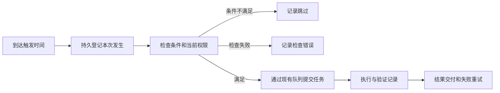

# DutyDeck 与 Botmux、相关竞品的融合取舍

**值得继续吸收，但下一轮应集中在受管工作目录、可核查交付、条件式自动化，以及不同 Agent 的真实能力展示。** DutyDeck 已有飞书入口、问答审批、材料收集、文件回传和有条件的运行中恢复。继续扩展时，收益主要来自让这些能力稳定串起来，以及让任务在等待 CI、定时触发等情况下继续工作。

建议保留本地执行、飞书指挥、Web 查看证据的产品分工。Botmux 适合提供具体机制和故障处理样本；并行编码工作台适合提供工作目录与交付设计；云端 Agent 产品适合提供事件触发与等待机制。整体替换 Runtime、移植完整工作流引擎、增加独立手机 App，当前收益不足以支撑维护成本。

本文的建议优先级表示投入顺序，不是线上故障等级。S/M/L 均为相对工作量 **estimate**：S 指局部适配和展示，M 指跨模块但边界明确的改动，L 指涉及持久状态、执行和恢复的系统改动；不承诺工期。收益是产品判断，使用频率及提升幅度均为 **unverified**。

| 建议 | 优先级 / 成本 | 用户得到什么 | 判断依据 |
|---|---|---|---|
| 统一展示启动、审批、恢复与交付的实际能力 | P0 / S–M | 提前知道这台机器上的这个 Agent 能做什么，失败后知道如何继续 | 当前文档、API 与实际实现已有差异；可复用现有探测和运行状态 |
| 受管 worktree 与结构化交付证据 | P1 / M–L | 同一仓库的并行任务有各自目录；结果附对应版本的 diff、测试和文件 | 当前会话可共用 cwd；运行结束还不能证明改动满足要求 |
| 接通条件式定时执行 | P1 / L | 定期检查实际运行，条件不满足时跳过，执行和通知都可追踪 | 已有定义、时区、发生记录和租约基础，但所有执行路径仍受禁用契约约束 |
| 一个外部事件源唤醒原任务 | P1，接在交付与调度之后 / M–L | CI 返回或评审回复后接着做，无需反复催问 | 复用任务队列和持久接收；增加有期限的等待订阅 |
| Skill 按 Agent 投递并记录实际结果 | P1 / M | 选择一项能力后，能确认本轮实际提供了哪些指令 | 当前目录发现和 `/skills 名称` 文本引用不能证明所有 Agent 都加载成功 |
| 原生用量归属与保留策略 | P2；自动化放量前完成 / M | 找到重复运行、失败和长上下文开销；历史数据可管理 | 已有 usage 事件，尚缺统一轮次账本和保留期 |

## 当前能力基线

本地代码基线为 2026-09-12 的 DutyDeck `f0d9bc1c64eebd09bff8410cdcd0db486237c14f`，以及本地 Botmux `e636f93cb33e80d9241a0d7e2270e5e08b2f0dd5`，后者提交时间为 2026-09-11。结论针对这两个 checkout，不代表已部署版本或远端最新提交。开始时 DutyDeck 有未跟踪的 `.trae/`，Botmux 有未跟踪的 `.prs-new.json` 和 `.worktrees/`；这些内容未作为能力证据。

9 月 8 日的[竞品研究](competitor-research-feishu-first-2026-09-08.md)和[实施记录](feishu-workflows-implementation-2026-09-08.md)是历史背景。当前实现已有后续变化，不能直接复用其中的缺口清单。

| 能力 | 当前实现和验证边界 | 本轮处理 |
|---|---|---|
| 飞书发起、查找与继续任务 | `/tasks`、引用续作、`/new --cwd/--model/--effort` 已接通；材料保留来源和话题水位 | 保留，补工作目录分配体验；不再列为从零开发。[^1] |
| 入站消息恢复 | inbox 在确认收到前持久保存，Runtime 使用稳定任务键；恢复时重查配置和权限 | 复用到新触发入口；现有飞书去重不自动覆盖外部 webhook。[^2] |
| 问答与 ACP 审批 | 有真实请求绑定、一次性决策、身份检查、文字命令回退和失效处理 | 保留；PTY 原生提示仍按实际能力处理。[^3] |
| 运行中恢复 | PTY 在自有 tmux、轮次标识及 transcript 游标均成立时可续接原轮次；无法确认则中断，不重新提交原指令 | 完善能力展示与供应商验证；不重写一套恢复引擎。[^4] |
| 过程与结果交付 | 当前实现冻结过程卡，再发送独立结果；过长答案通过 Markdown 文件完整交付，缺失部分分别对账 | 沿用当前交付形式，补证据关联。新任务不会自动生成验收请求。[^5] |
| Agent 文件回传 | 有工作目录检查、内容指纹、CAS 和发送重试；本地文件读取要求 Linux `/proc/self/fd` | 已实现但有平台边界；Mac 用户扩大后需要补齐。它不等同于直接生成的结果 Markdown 文件路径。[^6] |
| 定时任务 | 可保存 staged/disabled 定义、编辑和预览；Schema、readiness 和 API 均禁止实际执行 | 必须完整扩展执行契约，不能仅添加 timer。[^7] |
| 多 Agent 与群协作 | 已有 ACP/PTY 适配、会话队列、群工具 capability 和动作授权 | 复用现有边界；不把新增编排当作接入前提。[^8] |
| 工作目录隔离 | 创建两个会话可以给出同一个 cwd，两个 Driver 都收到该目录；平台不自动建立 worktree | 优先补平台管理的目录和分支归属。Agent 自行使用 worktree 仍然可行。[^9] |
| Skill 与用量 | 已有本地 skill 发现、Web 选择和 usage 展示；选择 skill 最终拼成文本引用 | 需要记录实际投递及用量来源，不重复开发目录扫描。[^10] |

DutyDeck 本轮定向测试为 **7 个文件、54 项通过**。其中真实 tmux 测试使用 shell 进程和合成 Claude JSONL；Runtime 与飞书恢复测试使用真实存储和模拟执行端/飞书服务。它们证明本地契约，不证明所有供应商 CLI、真实租户权限或手机端渲染均已验证。

当前有三处值得先修正的能力描述：README 和飞书指南仍写同卡终态、运行中一律中断；Schedule API 固定报告 UI 未接入，但 `App.tsx` 已挂载预览面板。前两项影响用户对通知和重启的预期，后一项会把已存在的入口显示为缺失。应让文档和公开状态跟随运行装配，而不是以旧文档限制现有能力。[^4][^5][^11]

## Botmux 值得吸收的机制与取舍

Botmux 与 DutyDeck 的运行边界最接近：都连接本机 Agent，将会话和工具活动映射到飞书。DutyDeck 的 PTY、CLI adapter 和终端代码已吸收过相关实现，9 月 12 日的 `6f84d2e` 又引入启动修正和飞书新会话参数。因此下一轮应按具体机制取舍，而不是再做一次整体“能力追平”。

### 把工作目录准备保存为可恢复阶段

Botmux 的 pending repo journal 保存待选择仓库时的原请求、附件和发起者；恢复后能继续选择。它的 worktree 服务处理已有 linked worktree 的归一化、分支碰撞和失败回滚。这些机制能直接补上 DutyDeck 从收到消息到启动 Agent 之间的目录准备阶段。[^14]

建议吸收 journal 的恢复语义和 worktree 归属处理：用户选目录或准备依赖时，任务仍是可追踪的准备中状态，服务重启不丢原目标。不要照搬失败后的所有降级行为。Botmux 的默认 worktree 创建失败可回退共享基础目录；如果 DutyDeck 已向用户承诺独立目录，这种回退会破坏承诺，应保留失败状态并给出可恢复操作。引用未更新也应明确显示基线，不能在 fetch 失败后默认宣称使用最新代码。

最新提交还处理了仓库选择卡过大和发布失败：按字节预算裁减选项，保留原序号，并在发卡失败后退出等待。DutyDeck 将来增加选择器时可采用预算和可恢复失败状态，避免用户根本看不到卡片却一直等待选择。Botmux 的失败路径可以转到默认 cwd 开工，单个极大选项也可能仍超预算；这两点应改为显式目录入口或明确失败，不能静默在其他仓库执行。[^20]

### 用恢复故障矩阵加固已有恢复

Botmux 在会话存储和恢复中使用进程/boot 标识、占用租约、快照与 CAS，并区分进程不存在、存在和无法确认；恢复异常可隔离到单个会话，也有恢复错峰和隔离状态。值得借鉴的是这些故障场景，尤其是进程探测返回 unknown、同一会话出现重复后端、存储异常及大量会话同时恢复。[^15]

DutyDeck 已有自有 tmux 的轮次验证与 JSONL 重放，更合适的投入是补真实供应商样本和故障场景，并展示“原进程续接”“原生上下文续作”“新进程重新开始”的区别。保留 SQLite 和事件序列，无需引入 Botmux 的整套 JSON 行存储方式。两个项目之间的历史会话导入也不等于已确认原进程归属。

### 采用条件、忙碌策略和通知语义

Botmux 的 Scheduler 包含按 App 归属的计划、时区、错过触发后的宽限以及独立 tick；Schedule Store 提供持久替换和稳定标识。其价值在于把周期工作变成用户能查看、暂停和理解的行为，适合借作 DutyDeck 调度交互的样本。[^16]

执行器不宜直接移植。当前源码的 tick 读取到期任务后执行，没有跨进程 occurrence 原子占用；两个实例可能同时读到同一条到期任务。这个风险判断主要依据 tick 和普通存储更新的代码路径。[^16] 本次会话另做了临时隔离实验：两个 Bun 进程共用真实 Schedule Store，均更新下次时间后进入模拟派发，得到两条模拟执行记录。实验为辅助佐证，未运行完整双 daemon/飞书链路，也不代表生产事故。DutyDeck 应将现有 occurrence、generation 与租约扩展为实际运行契约，再接入条件检查和执行。[^31]

Botmux 的前置条件实现更值得借鉴：区分条件不满足和检查错误，约束输出与运行时间，超时终止进程组，并把可执行条件放在独立 sidecar 中，通过任务标识和内容指纹绑定。需要保留其来源分离思路；当前 runner 用 daemon 权限执行 shell，不能直接把普通群消息中的任意脚本变成前置条件。DutyDeck 首版可只提供受控的 CI 状态检查，在取得本次发生的执行权之后、调用模型之前运行。[^16]

### 保留群内让路语义和更严格的权限边界

Botmux 的消息路由会处理群中定向提及、话题归属和机器人让路，适合用于验证“明确找 A 时，B 不插话”。DutyDeck 已有 App、群、话题及群工具能力边界，可以增加多 Bot 同群场景测试，不需要为此新建通用多 Agent 编排引擎。[^17]

具体权限判断不能直接复制。Botmux 的部分 operate 路径把空 allowlist 视为开放，也允许团队机器人参与操作；DutyDeck 应继续按实际操作者、动作及范围判断。群里能说话、能读取上下文与能批准高危执行是不同能力。

入站去重也应保留 DutyDeck 当前方案。Botmux 的 seen-message store 在异步处理前记录消息标识，使用有期限、有容量上限的去重集合；记录成功到任务持久接收之间仍可能有崩溃窗口。DutyDeck 的 inbox 状态与稳定任务键更适合恢复执行，不宜替换为“看过这个消息就忽略”的集合。[^17]

### Skill 解析和投递快照比目录数量更有价值

Botmux 在 CLI 启动前解析 global、Bot、项目等来源的技能，生成 manifest 和会话提示。Claude 路径支持限定目录的原生插件投递，其他 CLI 主要收到 prompt 目录说明。它提供了“配置选择如何变成实际输入”的实现样本，适合改进 DutyDeck 当前的文本引用。[^18]

但投递方式不能混称为原生加载。Botmux 的 `trusted` 策略还是 `all` 的兼容别名，不能当作技能信任边界；恢复时重新解析配置也可能改变技能集合。DutyDeck 应保存实际投递快照，刷新产生新版本，不静默覆盖历史运行采用的技能。

### 用量记录先解决重复和缺失

Botmux 的用量实现区分输入、缓存输入、缓存写入和输出，把供应商累计统计转成轮次增量，并处理重复、累计值回退和重启后的基线重建。确定性记录标识及归属标记用于减少多个解析来源重复记账，值得吸收到 DutyDeck 的原生 usage 事件处理。[^19]

该账本采用 best-effort 写入，部分异常返回空值，价格也可能未知，不适合作为精确账单或强制配额的依据。建议先服务排障：记录 provider、来源事件、轮次、统计口径和是否估算；缺失保留 unknown，重放不重复累计。工作目录、任务标题和用户/群归属属于受控元数据，汇总页面和导出按既有访问范围裁剪。

## 相关竞品提供的增量参考

以下线上资料访问于 2026-09-12；未单列发布日期的页面未标明发布日期，表中能力以本次可读的官方文档/源码为准。没有运行这些产品的完整服务，不作性能、稳定性或市场份额排名。

| 产品与定位 | 资料支持的具体机制 | DutyDeck 如何吸收 | 边界和直接依赖判断 |
|---|---|---|---|
| Conductor：并行编码工作台 | workspace 关联 worktree、分支、终端、diff、PR 和归档；setup 处理新目录所需文件，checks 汇总执行与评审事实 | 优先借独立工作项和交付目录的生命周期，保留 diff 评论到继续修改的关联。[^21] | 开发目录隔离不等于系统沙箱；checks 展示不自动等于强制验收。借设计，不依赖其桌面产品 |
| OpenCode：可独立连接的 Agent 服务 | 客户端/服务端分离，OpenAPI 与事件流，提供异步 prompt、会话状态、diff、fork 和权限响应 | 为真实支持这些接口的 adapter 暴露结构化能力，复用现有 Driver 契约。[^22] | 原生权限和目录访问规则不是操作系统隔离；不把该服务直接作为公网控制面 |
| Claude Code Channels / Remote Control：本地会话的远程入口 | Channels 匹配权限请求 ID，多入口先到的决定生效；项目 trust 等确认不转发；Remote Control 依赖本机执行环境 | 明确“已持久接收”“已提交”“执行开始”；将恢复和原生确认的限制展示给用户。[^23] | 写入消息 transport 不能证明 Agent 已处理；沿用 DutyDeck inbox，不用消息转发替代持久任务 |
| Happy：多端访问本地 Agent | 持久 update 与临时 presence 分离，递增序列和乐观版本更新；本地 transcript 去重和终止后的工具状态收口 | 复用现有 SSE/CAS，补多端竞争和未闭合工具状态的故障用例。[^24] | 加密对象有区别，不能笼统声称所有数据都是端到端加密；飞书收发也不适合套用独立加密消息系统 |
| OpenClaw：多通道 Agent Gateway | 飞书消息与文档评论持久接收后按范围分发，路由和访问判断分开；会话可精确绑定 ACP | 如果增加文档评论入口，沿用 inbox，并明确每种事件的持久化覆盖范围。[^25] | 其持久保证只覆盖文档明确指出的事件类别；不移植整个 Gateway 或全量工具集 |
| OpenHands：可持久化 Agent 与执行服务 | 保存会话状态和事件，按会话恢复；Agent Server 输出类型化事件 | 借恢复快照的完整性和新事件向前兼容；保留未知输出的原始记录。[^26] | 会话持久化不能恢复所有外部副作用；引入该执行服务会增加环境与权限管理成本 |
| cc-connect：聊天驱动本地 CLI | cron 可选择复用或每次新会话，有超时与通知配置；提供多工作区和附件回传命令 | 借定时任务的可见上下文策略和手机端操作说明。[^27] | 本轮只核实文档接口，没有验证多进程调度或崩溃恢复；不替换 DutyDeck 现有 Runtime |
| Cursor Cloud Agents：事件驱动工程任务 | 订阅把外部变化作为同一会话后续消息，短时事件合并；成果可附截图、视频和日志；自动化有触发条件及执行身份 | 借有期限等待、来源重读和交付证据；本地继续执行。[^13][^29] | 当前 API v1 采用持久 agent 加每轮 run；文档注明 webhook 尚未提供，旧 v0 仍支持，不能混用两套接口承诺 |
| Lark 官方 OpenClaw 插件 / acp-link：飞书材料与轻量 ACP 桥接 | 前者提供文档等办公工具；后者提供 ACP 到飞书的消息和周期 prompt 路径 | 文档读写按实际需要复用已有 skill/CLI，先证明授权和回报目标。[^28] | 工具存在不代表当前 Bot 或用户身份已授权；这些能力不足以支持整体替换 DutyDeck |

Vibe Kanban 可作为历史机制参考，但不列为优先上游依赖。官方 v0.1.44 发布说明含 sunsetting notice，2026-06-02 的维护讨论提及此前已宣布公司将关闭，并征询社区接续意愿。这个事实支持“维护责任需重新评估”，不支持断言仓库所有开发活动已经停止。[^30]

这些对照支持同一取舍：从竞品吸收接口和失败处理，把执行、授权、队列、事件及交付继续留在 DutyDeck 的一条运行路径中。直接安装第二个桥接系统来接管同一个飞书 App，会引入额外的所有权和重复消费问题。

## 建议的接入设计

### 工作目录与证据一起管理

典型场景是同一项目同时执行“修登录问题”和“修改报表”。当前它们可以成为两个独立会话，但仍操作同一目录。会话队列只能串行化同一会话的指令，不能防止两个会话改动相同文件。这个风险来自当前目录分配路径；本轮没有让两个真实 Agent 覆盖文件，不将风险判断写成已复现的数据损坏。

建议按**可独立交付的工作项**建立 worktree。沿用同一工作项的多轮追问继续使用它；独立并行工作项建立另一个目录，普通只读调研可以继续使用原目录。产品层的工作项可以先绑定现有 Session，避免给每一条内部 `TaskRecord` 都创建新分支。[^9]

平台最少记录仓库根目录、基线 commit、分支、工作目录、归属和清理状态。创建时不切换共享 checkout，也不自动搬走用户未提交改动；发现脏工作区时让任务明确基线。依赖安装和预览服务属于该工作目录的准备过程，失败应显示为准备失败，不能让 Agent 在错误目录继续执行。

结果证据应绑定到本轮和实际代码版本：测试命令、退出码、执行目录、时间、对应 commit 或 diff 指纹、日志/截图/文件引用。Agent 的自然语言总结单独显示为“Agent 报告”；平台实际观察到的命令执行记录可以显示为执行证据。测试成功后如果代码继续变化，原证据应标记版本已变化。

当前 `resolveTaskOutcome()` 会检查中断、执行错误、截断及最终回答是否存在，但没有判断项目验收条件。因此建议保留执行状态，新增独立的验证和交付状态。例如“执行已结束 · 验证失败 · 报告已送达”，让用户知道下一步处理什么。不要把出现“tests passed”文字或普通工具调用成功直接计为验证通过。[^12]

首批接入位置是 Runtime 创建 Session 前的目录分配，以及终态后的证据保存与 Web 展示。飞书结果保留摘要和查看入口；新状态不要求用户逐任务点击验收。合并和发布保持现有授权规则。

完成标准：两个工作项同时修改同名文件时目录不同；重启后仍映射原目录；测试证据与当前 diff 匹配；归档时保留未提交或未交付内容，不误删用户原目录。worktree 只隔离 Git 工作目录；凭据、宿主文件和网络访问的隔离需要另行实现。

### 定时任务需要执行契约与条件检查

最合适的起点是一个明确场景：工作日检查指定 CI，只有发现新失败才启动诊断，将结果发回指定话题。先由轻量检查得到 `run / skip / error`，再决定是否调用 Agent。条件不满足应记录跳过，检查失败应记录错误，两者都不能被静默当作任务成功。

DutyDeck 现有 Schedule 基础包含时区、DST、definition generation、occurrence 幂等键、watermark 和 lease；但定义只允许 staged/disabled，发生记录也没有完整的 claim、执行和失败状态，运行意图固定 `dispatchAllowed: false`。这些约束共同阻止执行。下一步需要扩展状态、执行器和授权路径，不能只把 API 的 `executorWired` 改成 true。[^7]



图中的执行链是建议设计，当前 Schedule 尚不能走通。实现前应定下忙碌时的处理方式、停机后的补偿策略、执行超时、上下文是否重用，以及每次汇报或仅有变化时汇报。首版可以采用同一计划不重叠执行、停机后有界补偿、每次独立 Agent 上下文；项目约定通过显式材料提供，避免周期任务持续累积无关历史。

新建的 DutyDeck 计划和从 Botmux 导入的计划必须分别处理。新计划只需在 DutyDeck 自身的所有权范围内接通运行和交付；当前 foundation Bot 仍受禁用契约约束，需要建立明确的可运行绑定。来自 Botmux 的 enabled 计划还涉及来源停止和跨进程排他，仅在 DutyDeck SQLite 里取得 lease 无法阻止 Botmux 自己再次执行。旧迁移蓝图中的接管限制不能因新调度器完成而解除。

完成标准：重复 tick 和重复启动只产生约定的一次任务接收；条件跳过不调用 Agent；执行后宕机不会重复提交已接收指令；通知失败只补通知；撤销权限后未来触发停止；修改时区或计划后旧 generation 不继续调度。端到端的无限期 exactly-once 不作为承诺。

### 外部事件唤醒采用窄范围订阅

首个入口选择项目实际使用的一种 CI 来源。“等这次构建完成再处理”应保存为有期限的订阅，绑定仓库、工作项、目标分支/commit、事件类型和回报位置。事件到来时先持久接收、去重、合并短时间内的重复变化，再读取 CI 当前事实，按现有队列给原会话增加一轮指令。

这与长时间挂着一个 `session ask` 等待器不同：服务重启后订阅仍存在，原执行端结束也不妨碍未来启动新一轮。事件与对应工作项绑定，旧 commit 的 CI 结果不能触发最新分支的修复；归档、取消、超时或权限撤销后不再唤醒。用户手工推进分支时应重新判断订阅是否仍适用。

Cursor 的订阅机制提供了同一会话继续、事件合批和唤醒后重读来源的参考。该思路适合本地 DutyDeck；其云端执行环境不需要一起引入。[^13] 如果公司 CI 无法向本机回调，可先用有水位的定时查询获取变化。只有确认具体 CI 的事件和认证接口后再实现来源适配，其可用性目前为 **unverified**。

首批只支持一个来源、明确事件和有期限等待。持续多目标自治、跨系统任意事件规则和 DAG 编辑器留在后续。完成标准是同一事件不重复开任务、旧版本事件无效、任务忙碌时正确排队、重启后继续等待，并能从飞书看见取消入口。

### 能力与 Skill 投递显示实际结果

当前 Agent 能力配置主要是 `pause/resume`，实际行为还受协议、原生 transcript、tmux、平台和当前等待请求影响。应结合配置与运行探测生成能力状态，至少区分结构化审批、终端输入、原生续会话、当前轮次恢复和文件回传。可用、不可用和未验证要有不同表达；例如“支持查看终端；本轮无法验证恢复边界”。[^4][^6][^8]

不需要建立一张手工维护的庞大兼容表。现有 Driver 方法和启动探测是数据源，真实供应商测试提供证据日期和版本。工作区信任或 CLI 首次初始化阻止启动时，显示具体阻塞和处理入口。对不支持的 PTY 提示，不把任意终端 `y/n` 推断成可远程批准的结构化请求。

Skill 部分，先修正“已选择”和“已投递”的含义。DutyDeck 当前发现目录中的 `SKILL.md`，Web 把选择拼成 `/skills 名称`。建议保存选中的规范路径/来源、内容版本和投递方式，由 adapter 决定原生加载、会话级文件引用或明确的 prompt 注入。仅支持确认可读、作用域合适的本地技能；不要为方便投递改写整个用户级配置。[^10]

验收使用同名不同来源技能、Agent 不支持原生命令、重启续作和工作目录变化四种情况。平台可以证明指令已提供；Agent 是否在每一步遵守指令仍需行为验证，不能显示成自动保证。

## 投入顺序与明确暂缓的内容

建议先完成能力描述的小修正，再交付受管 worktree 和证据记录；条件式调度作为下一项完整功能。事件订阅复用这些能力。Skill 投递可以独立推进，不依赖调度上线。

| 顺序 | 可评审的交付 | 通过标准 | 主要代价 |
|---|---|---|---|
| 1 | 实际能力说明与运行状态 | 不再把有条件恢复写成全部可恢复或全部中断；Schedule 预览入口与 API 口径一致；文件回传显示平台限制 | 需要从已有探测与装配取值，避免新建一份静态兼容名单 |
| 2 | 一个仓库的并行交付流程 | 两个独立工作项不共用可写目录；重启继续原目录；每份测试和产物可关联代码版本 | 目录准备、脏状态、依赖与清理策略需要一起设计 |
| 3 | 一个 DutyDeck 自有计划实际运行 | 触发、条件、权限、队列、终态和通知均持久可追踪；重复触发及中途重启不重复接收任务 | 需扩展现有禁用 Schema、执行状态和运行绑定；Botmux 来源计划另有接管条件 |
| 4 | 一种 CI 事件继续原工作项 | 去重、旧 commit 拒绝、合批、过期、取消和重启等待都可验证 | 依赖具体 CI 的认证/事件接口；该外部条件尚未核实 |
| 并行项 | 一项 Skill 在两个受支持 Agent 上实际投递 | 来源、内容版本和投递方式可查；不支持时有明确结果 | 适配器之间的原生命令与文件发现方式不同 |
| 放量前 | 用量归属、历史保留与运行上限 | 缺失用量保持 unknown；重放不重复计数；归档不破坏未完成交付 | 需要区分累计上下文、轮次增量和供应商费用口径 |

如果实际使用以周期巡检为主，可以将顺序 3 提到顺序 2 前，首批计划限制为只读检查和报告。需要自动修代码时，仍应先具备工作目录归属和结果证据。当前没有任务类型占比，以上默认顺序依据工程工作台定位作出，属于产品判断。

以下内容暂不建议投入：

- **完整 Botmux workflow/Hammer 执行引擎。** 当前任务、会话和队列足以承接上述增量；增加第二套调度与恢复状态会扩大维护面。特定工作流确有执行要求时再单独评估，历史归档不等于支持执行。
- **完整浏览器接管平台。** 先用已安装 Agent 工具执行浏览器任务并回传截图；只有远程开发机必须使用用户桌面登录态成为高频场景时，再建设受限的浏览器连接能力。该使用频率未核实。
- **独立移动客户端和加密中继。** 当前飞书和响应式 Web 已覆盖主要入口，新增客户端会增加同步、推送和认证维护；Happy 的多端版本控制经验可以独立采用。
- **全量办公工具、插件市场和自动记忆系统。** 指定文档读写与已安装 Skill 足以先验证价值。项目记忆应有来源、可编辑和删除；不要把所有群聊自动转成长期指令。
- **为了数量增加 PTY adapter 或复制所有终端后端。** 先把常用 Agent 的启动、审批、恢复和产物路径验证完整。已有支持列表不能替代真实协议能力证据。
- **恢复强制结果验收。** 当前新结果不创建验收记录。结构化验证证据可以独立增加，无需把每次工作结束变成新的用户确认步骤。[^5]

## 迁移与验证边界

融合能力与迁移当前 Botmux 服务是两项工作。DutyDeck 的 importer 仍定位于 discover、plan 和 archive，控制面对象和来源计划的禁用状态不能作为可运行能力。现有 live Lark 路径与 foundation 路径也不能混称为同一接入状态。工作项隔离、Skill 投递等能力可以先在 DutyDeck 自有任务中使用，不要求先接管 Botmux。

接管真实 App 时，需要另行证明原监听和调度已停止、目标持有有效所有权、未完成消息和任务有明确去向，以及故障后能恢复服务。保留 Botmux 源码中的恢复测试经验，不等于获得跨运行时接管证明。当前研究没有重测真实 Botmux 数据迁移，也不复用旧报告中的生产 App、群和活跃会话数量。

验证证据如下：

| 核查 | 本轮实测结果 | 能证明什么 / 不能证明什么 |
|---|---|---|
| PTY Driver 恢复 | 7 项通过 | 包含真实 tmux 原 PID 续接、离线完成重放、错误身份和游标拒绝；供应商交互由 shell 与 JSONL 夹具代替 |
| Runtime 重启 | 9 项通过 | 覆盖持久存储重新打开、队列和恢复失败；Driver 为测试替身 |
| 飞书 daemon 恢复 | 6 项通过 | Runtime 与 Coordinator 的恢复和交付对账；飞书为模拟服务 |
| 飞书工作流集成 | 19 项通过 | 材料、任务、问答、权限和过程/结果交付的跨模块路径；未验证手机真实渲染 |
| Schedule API 与存储 | 3 + 5 项通过 | 证明现有编辑/预览和禁用边界；不证明能运行计划 |
| 本地文件交付 | 5 项通过 | 真实临时文件与模拟上传/发送；不证明非 Linux 支持 |
| 同目录会话 | 一次隔离 Runtime 检查通过 | 两个不同 Session 的 Driver 均收到同一 cwd；未执行 Agent、未改项目文件 |

Botmux 另有 **7 个文件、301 项通过**：仓库卡 195、接收失败回执 13、前置条件配置 18、条件执行 14、用量账本 33、Codex 用量转换 25、Claude Skill 投递 3。测试包含真实临时目录、bash 和 sidecar；用量测试中的价格计算有 mock，Skill 原生投递只覆盖 Claude。测试通过支持具体实现机制，不代表跨供应商和生产环境均已验证。机器可读结果及调度竞争复现见证据脚注。[^31]

复现定向测试的命令：

```bash
node node_modules/vitest/vitest.mjs run --maxWorkers=3 \
  packages/pty-driver/src/driver-recovery.test.ts \
  packages/agent-runtime/src/restart-recovery.test.ts \
  apps/server/src/lark/daemon-recovery.integration.test.ts \
  apps/server/src/lark/workflows.integration.test.ts \
  apps/server/src/schedule-routes.test.ts \
  packages/storage/src/schedule-foundation.test.ts \
  apps/server/src/lark/artifact-delivery.test.ts
```

Botmux 定向测试在其仓库目录执行：

```bash
bun run vitest run \
  test/card-builder.test.ts \
  test/daemon-ordinary-ingress-failure-notice.test.ts \
  test/schedule-precondition-runner.test.ts \
  test/schedule-precondition-config.test.ts \
  test/usage-ledger.test.ts \
  test/codex-app-token-usage.test.ts \
  test/skill-claude-delivery.test.ts
```

版本库中只新增研究文档，测试夹具与输出保存在本机临时目录。未修改业务代码或测试断言；未拉取或切换源码分支，未启动生产 listener，未发送真实飞书消息，未启用定时任务，也未部署。源码与官方资料支持机制比较，真实用户完成率、费用改善和跨产品稳定性比较均为 **unverified**。

## 来源

本地源码链接对应文首 commit；线上来源统一访问于 2026-09-12。行号用于定位，后续代码变化时应以函数和 commit 复核。各条同时作为正文脚注。

[^1]: DutyDeck，[飞书命令表](/data00/home/huangyuhang.edu/ai/dutydeck/apps/server/src/lark/commands.ts:172)、[新会话选项](/data00/home/huangyuhang.edu/ai/dutydeck/apps/server/src/lark/new-session.ts)、[任务材料](/data00/home/huangyuhang.edu/ai/dutydeck/apps/server/src/lark/task-context.ts)。

[^2]: DutyDeck，[持久 inbox](/data00/home/huangyuhang.edu/ai/dutydeck/apps/server/src/lark/task-inbox.ts:22)、[接收后确认](/data00/home/huangyuhang.edu/ai/dutydeck/apps/server/src/lark/coordinator.ts:560)、[稳定任务接收](/data00/home/huangyuhang.edu/ai/dutydeck/packages/agent-runtime/src/index.ts:610)。

[^3]: DutyDeck，[问答和审批处理](/data00/home/huangyuhang.edu/ai/dutydeck/apps/server/src/lark/workflow-interactions.ts:170)、[Runtime 权限裁决](/data00/home/huangyuhang.edu/ai/dutydeck/packages/agent-runtime/src/index.ts:900)。

[^4]: DutyDeck，[PTY checkpoint/recover](/data00/home/huangyuhang.edu/ai/dutydeck/packages/pty-driver/src/driver.ts:277)、[Runtime 恢复](/data00/home/huangyuhang.edu/ai/dutydeck/packages/agent-runtime/src/index.ts:205)、[真实 tmux 测试](/data00/home/huangyuhang.edu/ai/dutydeck/packages/pty-driver/src/driver-recovery.test.ts:80)。

[^5]: DutyDeck，[冻结过程与结果交付](/data00/home/huangyuhang.edu/ai/dutydeck/apps/server/src/lark/coordinator.ts:1741)、[长结果文件回退](/data00/home/huangyuhang.edu/ai/dutydeck/apps/server/src/lark/result-delivery.ts:8)、[两条消息及无新增验收记录断言](/data00/home/huangyuhang.edu/ai/dutydeck/apps/server/src/lark/workflows.integration.test.ts:157)。

[^6]: DutyDeck，[文件读取和交付](/data00/home/huangyuhang.edu/ai/dutydeck/apps/server/src/lark/artifact-delivery.ts:24)。平台限制位于第 35 行，与文件内容指纹和幂等状态同文件实现。

[^7]: DutyDeck，[Schedule Schema 与禁用意图](/data00/home/huangyuhang.edu/ai/dutydeck/packages/shared/src/schedule-foundation.ts:6)、[管理 API](/data00/home/huangyuhang.edu/ai/dutydeck/apps/server/src/schedule-routes.ts:25)、[存储](/data00/home/huangyuhang.edu/ai/dutydeck/packages/storage/src/schedule-foundation.ts)、[API 禁止 enable/run-now 的测试](/data00/home/huangyuhang.edu/ai/dutydeck/apps/server/src/schedule-routes.test.ts:74)。

[^8]: DutyDeck，[Driver 契约](/data00/home/huangyuhang.edu/ai/dutydeck/packages/shared/src/driver.ts:61)、[生产装配](/data00/home/huangyuhang.edu/ai/dutydeck/apps/server/src/service.ts:158)、[公开 Agent 能力模型](/data00/home/huangyuhang.edu/ai/dutydeck/packages/shared/src/index.ts:39)。

[^9]: DutyDeck，[创建 Session 与 cwd 选择](/data00/home/huangyuhang.edu/ai/dutydeck/packages/agent-runtime/src/index.ts:435)。本轮内存 SQLite + 测试 Driver 功能检查返回 distinctSessions=true、sameCwd=true、driverStarts=2，未调用模型。

[^10]: DutyDeck，[Skill 发现](/data00/home/huangyuhang.edu/ai/dutydeck/apps/server/src/skill-catalog.ts:40)、[提示拼装和上下文用量](/data00/home/huangyuhang.edu/ai/dutydeck/apps/web/src/composer-utils.ts:18)、[ACP usage 归一化](/data00/home/huangyuhang.edu/ai/dutydeck/packages/acp-client/src/index.ts:122)。

[^11]: DutyDeck，[已挂载的 Schedule 面板](/data00/home/huangyuhang.edu/ai/dutydeck/apps/web/src/App.tsx:408)、[固定 uiEntryReady=false 的 API](/data00/home/huangyuhang.edu/ai/dutydeck/apps/server/src/schedule-routes.ts:34)。

[^12]: DutyDeck，[任务终态判断](/data00/home/huangyuhang.edu/ai/dutydeck/packages/agent-runtime/src/index.ts:150)、[过程卡的失败步骤摘要](/data00/home/huangyuhang.edu/ai/dutydeck/apps/server/src/lark/card-renderer.ts:757)。

[^13]: Cursor，[Cloud Agent Capabilities](https://cursor.com/docs/cloud-agent/capabilities)，Subscriptions、Demos and Artifacts 小节，未标发布日期。

[^14]: Botmux，[待选仓库 journal](/data00/home/huangyuhang.edu/ai/botmux/src/core/pending-repo-journal.ts:5)、[准备阶段恢复](/data00/home/huangyuhang.edu/ai/botmux/src/core/session-manager.ts:113)、[worktree 创建与回滚](/data00/home/huangyuhang.edu/ai/botmux/src/services/git-worktree.ts:110)、[默认 worktree 失败回退](/data00/home/huangyuhang.edu/ai/botmux/src/services/default-worktree.ts:69)。

[^15]: Botmux，[存储租约与快照](/data00/home/huangyuhang.edu/ai/botmux/src/services/session-store.ts:309)、[会话恢复](/data00/home/huangyuhang.edu/ai/botmux/src/core/session-manager.ts:2040)、[恢复探测和隔离](/data00/home/huangyuhang.edu/ai/botmux/src/core/session-manager.ts:2822)。

[^16]: Botmux，[Scheduler tick](/data00/home/huangyuhang.edu/ai/botmux/src/core/scheduler.ts:430)、[Schedule Store](/data00/home/huangyuhang.edu/ai/botmux/src/services/schedule-store.ts:430)、[前置条件执行](/data00/home/huangyuhang.edu/ai/botmux/src/services/schedule-precondition-runner.ts:85)、[条件 sidecar 校验](/data00/home/huangyuhang.edu/ai/botmux/src/services/schedule-precondition-store.ts:291)、[条件配置事务](/data00/home/huangyuhang.edu/ai/botmux/src/core/schedule-precondition-config.ts:67)。

[^17]: Botmux，[群消息分发与权限](/data00/home/huangyuhang.edu/ai/botmux/src/im/lark/event-dispatcher.ts:1493)、[operate 判断](/data00/home/huangyuhang.edu/ai/botmux/src/im/lark/event-dispatcher.ts:2080)、[消息先占用再异步处理](/data00/home/huangyuhang.edu/ai/botmux/src/im/lark/event-dispatcher.ts:865)、[有界已见消息集合](/data00/home/huangyuhang.edu/ai/botmux/src/services/seen-message-store.ts:1)。

[^18]: Botmux，[CLI generation](/data00/home/huangyuhang.edu/ai/botmux/src/core/plugins/cli-generation.ts:36)、[Skill runtime](/data00/home/huangyuhang.edu/ai/botmux/src/core/skills/session-runtime.ts:16)、[manifest](/data00/home/huangyuhang.edu/ai/botmux/src/core/skills/manifest-store.ts:7)、[原生投递选择](/data00/home/huangyuhang.edu/ai/botmux/src/core/skills/delivery.ts:13)、[trusted 兼容别名](/data00/home/huangyuhang.edu/ai/botmux/src/core/skills/policy.ts:59)。

[^19]: Botmux，[Codex token 增量](/data00/home/huangyuhang.edu/ai/botmux/src/services/codex-app-token-usage.ts:90)、[用量账本](/data00/home/huangyuhang.edu/ai/botmux/src/services/usage-ledger.ts:27)、[重启后的基线重建](/data00/home/huangyuhang.edu/ai/botmux/src/services/usage-ledger.ts:185)。

[^20]: Botmux，[仓库卡预算](/data00/home/huangyuhang.edu/ai/botmux/src/im/lark/card-builder.ts:1557)、[发布失败后的默认目录路径](/data00/home/huangyuhang.edu/ai/botmux/src/daemon.ts:17871)、[单个超大选项测试](/data00/home/huangyuhang.edu/ai/botmux/test/card-builder.test.ts:1838)。

[^21]: Conductor，[Git Worktrees](https://www.conductor.build/docs/concepts/git-worktrees)、[Workflow](https://www.conductor.build/docs/concepts/workflow)、[Checks](https://www.conductor.build/docs/reference/checks)，官方文档，未标发布日期。

[^22]: OpenCode，[Server](https://opencode.ai/docs/server/)（页面标记更新于 2026-09-10）、[Permissions](https://opencode.ai/docs/permissions/)，官方文档。

[^23]: Anthropic，[Channels Reference](https://code.claude.com/docs/en/channels-reference)、[Remote Control](https://code.claude.com/docs/en/remote-control)，Claude Code 官方文档，未标发布日期。

[^24]: Happy，[Protocol](https://github.com/slopus/happy/blob/main/docs/protocol.md)、[Claude Session Protocol](https://github.com/slopus/happy/blob/main/docs/session-protocol-claude.md)、[Encryption](https://github.com/slopus/happy/blob/main/docs/encryption.md)，官方仓库，未标发布日期。

[^25]: OpenClaw，[Feishu Setup](https://github.com/openclaw/openclaw/blob/main/docs/channels/feishu/setup.md)、[Advanced Configuration](https://github.com/openclaw/openclaw/blob/main/docs/channels/feishu/advanced-configuration.md)、[Channel Routing](https://github.com/openclaw/openclaw/blob/main/docs/channels/channel-routing.md)，官方仓库，未标发布日期。

[^26]: OpenHands，[Conversation Persistence](https://docs.openhands.dev/sdk/guides/convo-persistence)、[Agent Server](https://github.com/openhands/software-agent-sdk/blob/main/openhands-agent-server/openhands/agent_server/README.md)，官方文档/仓库，未标发布日期。

[^27]: cc-connect，[Usage 中文文档](https://github.com/chenhg5/cc-connect/blob/main/docs/usage.zh-CN.md)，Cron、多工作区及附件回传小节，官方仓库，未标发布日期。

[^28]: Lark Open Platform，[OpenClaw Lark Plugin](https://github.com/larksuite/openclaw-lark)；xufanglin，[acp-link](https://github.com/xufanglin/acp-link)，官方仓库 README，未标发布日期。

[^29]: Cursor，[Automations](https://cursor.com/docs/cloud-agent/automations)、[Cloud Agents API](https://prod.cursor.com/docs/cloud-agent/api/endpoints)，官方文档，未标发布日期。自动化产品触发能力与公开 API webhook 版本需分别判断。

[^30]: BloopAI/Vibe Kanban，[v0.1.44 发布记录](https://github.com/BloopAI/vibe-kanban/releases/tag/v0.1.44-20260424091429)（2026-04-24）的 sunsetting notice；[社区维护讨论 #3424](https://github.com/BloopAI/vibe-kanban/discussions/3424)，2026-06-02。

[^31]: 本次会话的临时佐证，2026-09-12：[Botmux Vitest JSON](/tmp/dutydeck-botmux-vitest-20260912.json)，success=true、301 passed、0 failed；[竞争复现脚本](/tmp/dutydeck-botmux-schedule-race-20260912.sh)、[双进程 worker](/tmp/dutydeck-botmux-schedule-race-20260912.ts)、[复现结果](/tmp/dutydeck-botmux-schedule-race-evidence-20260912/result.json)，模拟派发次数为 2。这些链接可能在临时目录清理后失效；长期复查以文首 commit、正文测试命令及脚注 16 的源码路径为准，不依赖临时文件存续。
