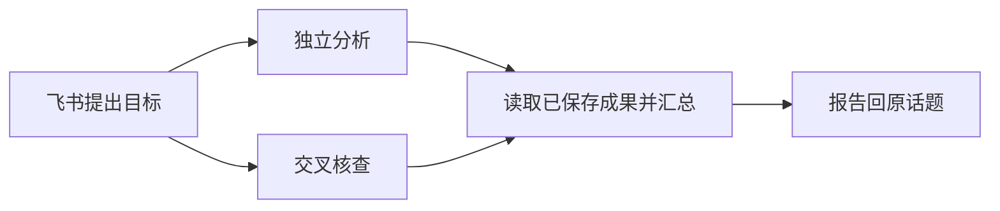

# 在飞书管理目标、Agent 步骤与成果

Dutydeck 将一个目标拆成可跟踪的步骤，由已配置的 Agent 分别执行，再把结果汇回原话题。用户继续和同一个飞书机器人交互，可以回答问题、处理工具授权、停止目标和复用流程。

实现基于本地 master `c053b38`：已有的会话 worktree、验证、Skill 快照、定时任务与 GitHub Actions 续作继续使用。本次新增目标编排和飞书工作台入口，没有引入 Botmux 代码或依赖。

## 从一个目标开始

在飞书中发送：

```text
/work research 比较这三个方案，核查来源，给出选型建议
```

Dutydeck 建立三个后台步骤：事实与方案分析、独立核查、报告汇总。前两个步骤可同时执行，汇总读取它们已经保存的成果。实例只有一个 Agent 时，也会创建独立 Session；有多个获准使用的 Agent 时，可以分别执行。配置存在不代表账户、搜索工具或文档工具已经授权。

也可以直接描述复杂目标。开启机器人群协作工具后，当前 Agent 会获得 `dutydeck work` 工具说明，按需创建结构化计划。普通单步请求沿用原来的会话执行方式。自然语言计划由当前 Agent 生成，平台负责校验和推进依赖。



每个步骤保存执行 Agent、依赖、尝试次数、后台指令与完整文本产物。产物包含 SHA-256 指纹。它证明保存内容的身份；业务正确性、代码测试结果和文档写入是否成功，需要各自的证据。

## 在同一入口继续处理

| 操作 | 飞书入口 |
| --- | --- |
| 查看此话题的目标 | `/work` |
| 查看步骤和成果 | `/work show 目标编号`，或卡片“刷新目标” |
| 停止全部步骤 | 卡片“停止全部步骤”，或 `/work cancel 目标编号` |
| 重试失败分支 | 卡片“重试”，或 `/work retry 目标编号 步骤编号` |
| 回答流程中的问题 | `/work answer 目标编号 步骤编号 回答` |
| 查看 Agent 执行中提问和授权 | `/work requests 目标编号` |
| 处理工具授权 | 原目标卡片中的“批准本次调用 / 拒绝本次调用” |
| 回答执行中提问 | `/work respond 目标编号 步骤编号 问题编号 回答` |
| 保存常用流程 | `/work save 目标编号 流程名称` |
| 查看已保存版本 | `/work templates` |
| 运行指定版本 | `/work run 流程编号 版本号 新目标` |

等待步骤持久保存，服务重启后仍可回答。原生工具授权和执行中的提问依赖对应的 Driver 或 relay 等待者；原进程不再支持续接时，旧请求不能被用来批准新一次执行。PTY 后端的终端确认可以用 `/work terminal 目标编号 步骤编号` 查看画面，再按返回的指令编号发送 `/work input` 或 `/work key`。输入绑定当前步骤和指令，并重新检查高风险与终端写入权限；这属于人工操作终端。普通 Web 子会话终端仍只读。

工具请求和回答绑定具体目标、步骤、指令和原始请求编号。卡片回调还校验消息、群、机器人与操作者；重复回答、旧请求和其他人的目标不会继续执行。并行步骤的权限来自各自目标发起人，不会随着父会话换人而改变。

飞书接收目标后先给出步骤卡，需要处理时再通知；最终成果独立发送。长报告使用现有 Markdown 文件交付。消息失败只重试交付，不重跑已成功的 Agent。每个目标的通知与交付独立处理，单条消息挂起不会卡住其他目标；HTTP 请求含响应正文读取最多等待十五秒，关闭服务会中止请求。

Web 会话中的“目标、步骤与成果”提供完整执行记录、文本成果、等待操作和模板入口。后台 Session 从普通会话列表隐藏，通过步骤记录进入；不能绕过目标往后台 Session 追加指令或修改执行配置。

## 用步骤组合工作流

计划支持两种步骤：

- `agent`：指定已配置的 Agent、任务说明、所需 Skill 和目录模式。
- `wait`：保存一个需要用户补充的问题；回答成为后续步骤输入。

`dependsOn` 表示依赖。`when: {stepId, equals}` 可按上游等待步骤的完整回答选择分支；条件不符的步骤会跳过。全部步骤必须通向一个无条件的最终 Agent 步骤。计划拒绝循环、未知依赖、重复步骤和缺少执行 Agent 的定义。

每次运行固定计划。以相同名称再次保存会创建新版本，已有运行不随模板更新。Skill 正文在叶子指令接收时固定，排队后修改文件不会改变已接收内容；模板没有冻结尚未接收步骤的 Skill 文件内容。

自然语言 Agent 使用当前指令专属的 `work --turn` 凭证，可以查询配置的 Agent、发现 Skill、创建和查询目标、保存或运行模板。仅有旧会话凭证无法创建新目标。后台步骤不获得递归编排入口，工具也不提供代替用户回答等待或批准权限的操作。

并行写代码时，计划应显式选择 `workspaceMode: "worktree"`。每个步骤得到独立工作目录，目录准备失败就停止准备。默认研究模板使用共享目录并要求阅读分析；共享目录不是写入隔离或安全沙箱。代码整合步骤需要明确读取哪些分支或成果，不会自动把不同 worktree 的修改合并。

## 定时任务也从飞书管理

```text
/schedule every 60 检查项目状态并报告新增问题
/schedule
/schedule enable 计划编号
/schedule disable 计划编号
/ci
```

`every` 创建停用的计划，核对执行内容后用 `enable` 启用。它复用现有 Session 自动化服务，仍按原会话上下文、权限、重叠策略和通知方式执行。同一飞书创建消息重放不会生成第二个计划。更详细的 cron、时区、一次性触发与条件配置继续在现有 Web 自动化面板中管理。

定时指令可以要求当前 Agent 使用指定模板；这仍是“定时唤醒 Agent，由 Agent 调用模板”。本次没有把工作流作为新的原生调度目标，没有另建 cron 循环，也没有启用 Botmux 导入计划或 Foundation 受管 listener。

## 执行与恢复边界

| 机制 | 当前行为 |
| --- | --- |
| 接收 | 先保存目标与尝试身份，再创建专属 Session；派发使用固定指令键 |
| 执行 | Runtime 管理指令状态，目标服务只推进步骤依赖 |
| 取消 | 先持久取消意图，再取消排队指令、停止已运行步骤；迟到结果不推进汇总 |
| 重试 | 失败分支最多三次尝试；成功分支保留原产物；不自动重试模型调用 |
| 停止证明 | PTY 检查所属执行资源是否确已消失；ACP 与 pipe 尚未提供此证明，取消后保守保留 `blocked` |
| 未知结果 | 无法证明旧执行资源已停止时保留 `blocked`，不自动重放外部动作 |
| 配置变化 | 原会话来源、目录、Agent 配置和权限变化会阻止继续，避免旧流程静默切换执行环境 |
| 容量 | 单目标最多三个活动叶子，全实例最多六个；每个计划最多十二步 |
| 时限 | 准备最长六十秒，执行最长一小时；停止等待十秒后保留不确定状态 |
| 成果 | 每步最多 512 KiB 文本，超限明确失败，不悄悄截断用于汇总的内容 |

这些保证以单个 Dutydeck daemon 拥有执行权为前提。SQLite CAS 防止过期状态覆盖，不能证明另一个 daemon 或远程进程已停止。工作目录隔离也不隔离宿主凭据和网络；当前继续面向个人及受信团队。

文档、表格、浏览器等操作由已接入 Agent 的工具和 Skill 执行。本次增加组合和交付入口，没有新建飞书办公 API 连接器，也未实际验证目标租户的文档写入、真实手机卡片和各供应商登录状态。

## 本地验证入口

```bash
pnpm exec vitest run --maxWorkers=3
pnpm -r typecheck
pnpm --filter @dutydeck/web build
pnpm --filter @byted/dutydeck build
node scripts/e2e-smoke.mjs --port 14687 --timeout 180000
```

新增集成测试使用真实 Runtime、SQLite 与 HTTP 路由，模拟 Agent 和飞书服务；浏览器冒烟使用生产构建、真实 Git/PTY、临时数据库和假 CLI。真实飞书配置、计划和线上服务未修改。


## 本次验证记录（2026-09-12）

| 检查 | 实测结果 |
| --- | --- |
| 全量单元与集成测试 | 197 个文件通过；2857 项通过，7 项跳过 |
| 独立代码审查 | 发现并处理了审批撤权、停止证明、旧回答入口、终端确认和通知阻塞问题 |
| 工作台网络测试 | 真实本地 HTTP 服务验证十五秒正文超时、调用者取消和关闭中止 |
| 生产构建浏览器冒烟 | 真实 Chromium / Git / PTY，假 CLI 与临时数据库，65 项断言通过 |
| 类型与构建 | 15 个 workspace 类型检查通过；共享包、Web 和 server 构建通过 |

冒烟包含两个独立步骤加汇总、成果展示、模板保存、拒绝绕过目标追加指令，以及真实终端等待确认、接受当前指令输入、完成后拒绝续写。最后的终端读取权限补强另通过工作台集成与权限回归测试。
