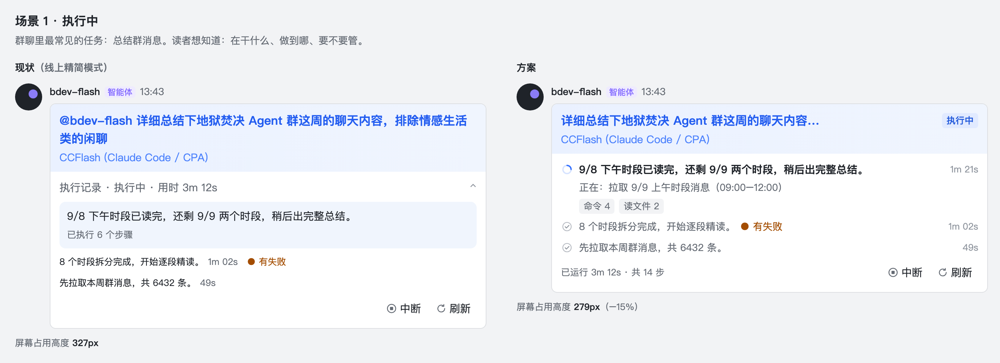
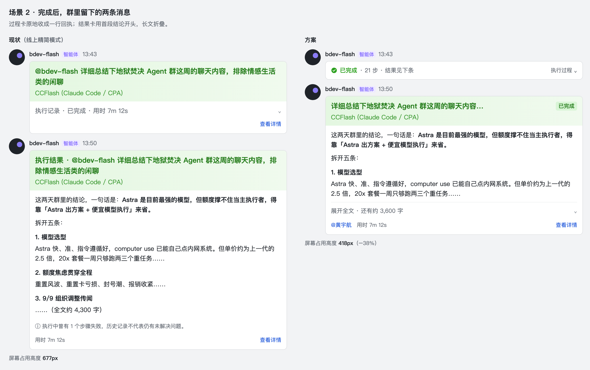
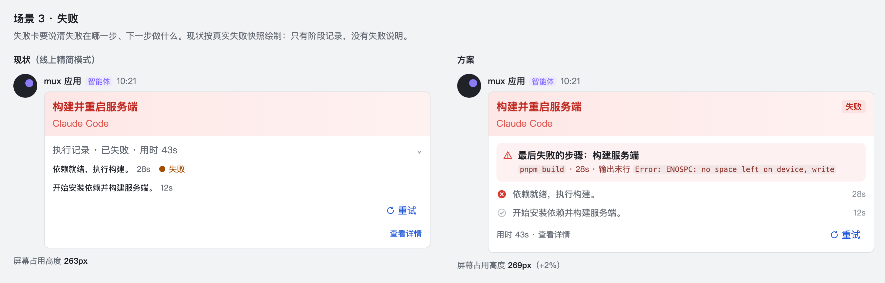
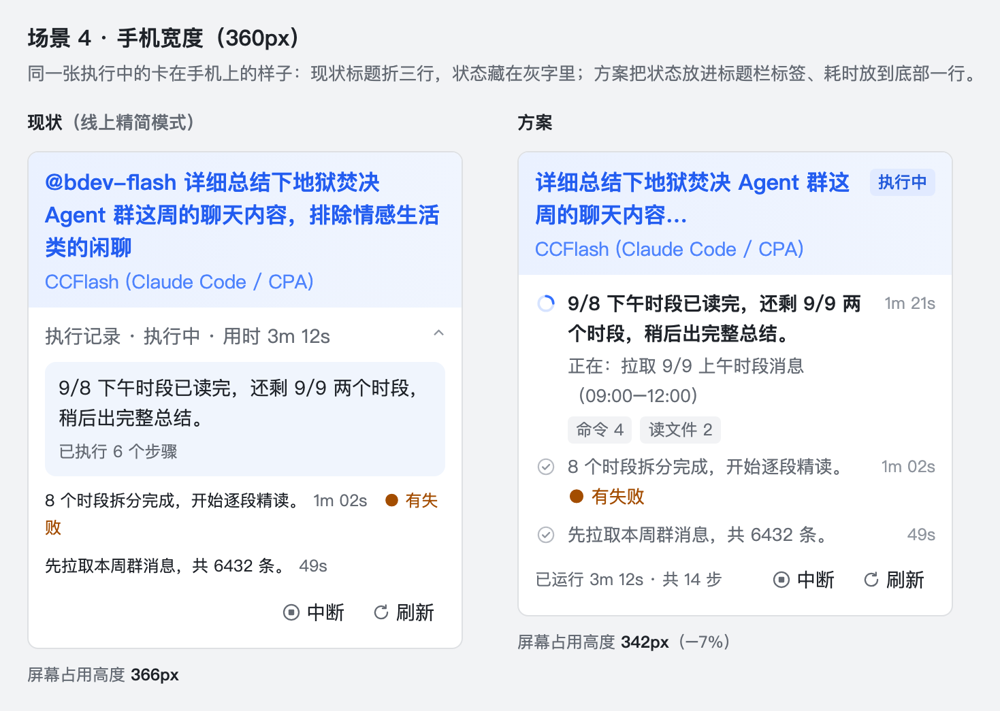

# 飞书任务卡片优化方案（2026-09-23）

## 结论

现在卡片的主要问题不在配色，而在两点。

一是**外壳占了太多注意力**：

- 群里一个任务会留下两张带大色块标题的卡。
- 17% 的任务标题以机器人自己的名字开头（「@bdev-flash …」）。
- 按现在的文案，一半的结果卡（22 个里 11 个）挂着一句「执行中曾有步骤失败」。
- 执行状态藏在一行灰字里。

二是**长任务看起来像卡住了**。多数任务是一个长阶段里连续跑十几到几十个工具（每个任务的工具调用中位数 11 次，p90 69 次）。卡上那行阶段标题在整个阶段里都不变，只有「已执行 N 个步骤」的数字在涨。

方案分三档：

| 档位 | 内容 | 工作量（估计） |
|---|---|---|
| **P0 去噪** | 标题清理；状态改成标题栏右侧的彩色标签；删掉免责声明；会话列表显示实时进度 | 约 1.5–2 天，风险低 |
| **P1 视觉升级** | 当前阶段加「正在：…」一行和工具类型计数；阶段带状态图标；完成后过程卡收成一行；长结果折叠；失败卡露出最后失败的步骤 | 约 3.5–5.5 天 |
| **P2 更大改造** | 打字机式流式输出、审批/提问卡重排、任务看板改表格 | 需要单独评估 |

按样稿量出来的屏幕占用（580px 卡宽，估计值）：

- 完成后群里那两条消息合计少 38%，这是收益最大的地方。
- 执行中的卡只少 15%。这一档主要让长任务一直有新东西可看，不以省高度为目标。
- 失败卡多 3%，因为多了一块现状没有的失败说明。

可交互版：浏览器打开 `assets/card-polish-20260923/interactive.html`，可以播放或拖动时间轴，看同一个任务从执行中到完成、以及失败时，两张卡怎么变。

---

## 1 现状：真实数据说明了什么

数据范围：

- 开发机主库 `.dutydeck/dutydeck.db` 里的 75 个飞书任务。其中卡片快照 75 份、事件流 72 份，都是只读查询。
- Tag 机器人自己的库里还有 9 个任务，没有统计进来。
- 75 份快照里只有 9 份是在精简模式下生成的（精简模式是后来才打开的）。所以下文结构类的数字取自结果正文和事件流，不取自快照的版式；「现状」图都按现在线上的精简模式绘制。

查询脚本见附录。

| 事实 | 数值 | 对设计的含义 |
|---|---|---|
| 任务发生在哪里 | 75 个任务**全部在群聊** | 每张卡都会被一群人看到，外壳噪声的代价会被放大 |
| 任务类型 | 抽样看，以「总结群聊」「查问题」这类非编码任务为主（未量化） | 读者关心进度和结论，不关心命令细节 |
| 每个任务的工具调用 | 72 个任务：中位数 11 次，p90 69 次，最多 117 次 | 执行中的卡要一直有新东西可看 |
| 阶段数（按旁白分段近似） | 中位数 1 个，p90 17 个；72 个里 40 个只有一个阶段，其中 11 个在这一个阶段里调用了 10 次以上工具 | 多数任务是一个长阶段。「做到哪了」要靠最新一步和累计计数来表达，多行时间线帮不上忙 |
| 工具描述 | 最近 400 次工具调用里 382 次是命令行，全部带 Agent 写的一句描述 | 「正在：…」这一行有现成的素材，不用猜 |
| 结果长度 | 中位数 791 字，p90 4356 字；52 个结果里 19 个（37%）超过 1500 字，11 个（21%）超过 3000 字 | 长结果在群里一条消息就占满几屏 |
| 结果里的格式 | 52 个结果中：列表 44、加粗 49、表格 15、标题 27（含 `###`） | 结果本身已经有结构，卡片不该再加重外壳 |
| 标题以「@」开头 | 75 个中 18 个；其中 13 个（17%）是机器人自己的名字，另外 5 个 @ 的是别的机器人 | 只该去掉机器人自己的名字；@ 别人的是原话的一部分，要保留 |
| 结果卡带「曾有 N 个步骤失败」 | 按现在的文案，22 个结果中 11 个；算上旧文案，52 个中 26 个 | 一半的结论后面跟着一句让人不安、又无从判断的话 |
| 失败任务 | 10 个失败快照里只有阶段记录，没有任何失败说明；任务事件里也没有错误字段 | 失败卡现在拿不到「失败原因」原文，只能展示执行记录里最后失败的步骤 |
| 耗时 | 有记录的 9 个任务中位数约 7 分钟（样本少） | 发起人等结果时大概率已经离开，结果送达时需要提醒 |
| 线上展示开关 | 4 个机器人都开了「精简过程卡」和「完成后收起过程」；3 个配了 Web 地址（内网 http）；群聊 @ 发起人都没开 | 用户看到的是精简模式 |

---

## 2 问题清单

按对观感的影响从大到小排列。

| # | 现象 | 为什么是问题 | 证据 |
|---|---|---|---|
| 1 | 一个任务在群里留两张卡：过程卡完成后仍保留完整的彩色标题栏（任务名 + Agent 名），下面才是结果卡 | 两张卡的标题几乎一样，第一张只剩「已完成 · 用时」一行有用信息，却占着一整张卡的视觉重量 | 场景 2 左侧；`service.ts` 过程卡完成态布局 |
| 2 | 标题就是用户原话：带着「@bdev-flash」，长的在手机上折三行；结果卡还要再加「执行结果 · 」前缀 | 标题最醒目，现在第一眼读到的是噪声；卡片本来就回复在原消息下面，原话已经在引用里 | 13/75 标题以机器人自己的名字开头；场景 4 |
| 3 | 状态只写在「执行记录 · 执行中 · 用时 3m 12s」这行灰字里 | 「执行中 / 等待审批 / 失败」是读者最想先知道的，现在只能靠标题栏底色猜；浅蓝和浅绿的渐变在群里扫一眼很难分清 | 你的截图；`service.ts` 的 `overviewTitleText` |
| 4 | 长阶段里卡片看起来不动：当前阶段的标题取 Agent 的旁白，没有旁白时取**阶段里第一个工具**的描述，下面一行「已执行 N 个步骤」 | 一个阶段跑 69 次工具时，这一行在整个阶段都不变，只有计数在涨，读者会以为卡住了 | 工具调用统计；`card-renderer.ts:708`、`714-716` |
| 5 | 历史阶段是 12px 的一行字，耗时跟在文字后面；旁白一长，耗时就落到第二行末尾；成功的阶段没有任何状态标识 | 版面零碎，也看不出哪些阶段已经结束 | `card-renderer.ts:631-635`；场景 1 左侧 |
| 6 | 长结果全文平铺 | p90 结果 4356 字，一条消息把群里的讨论推出好几屏 | 结果长度统计 |
| 7 | 一半结果卡末尾是「执行中曾有 N 个步骤失败，历史记录不代表仍有未解决问题」 | 读者读到的是「可能有问题」，却没有任何可以采取的动作。中间步骤失败后重试成功很常见，不值得在结论下面提醒 | 11/22；`card-renderer.ts:816` |
| 8 | 失败卡只有阶段记录，失败的阶段后面跟一个「● 失败」；哪条命令失败、输出里报了什么，要点「查看详情」才看得到 | 失败卡最该讲清的就是失败在哪 | 10 个失败快照；场景 3 左侧 |
| 9 | 同一句旁白在一张卡里出现两次 | 明显的重复 | 你第一张截图（「Check collaboration status and mandates」出现两次）；**根因还没查** |
| 10 | 会话列表里的预览是「执行过程 · 任务名 · 执行中」 | 不点进群就看不到任何进度 | `service.ts:772` 的 `summaryTitle` |
| 11 | 审批卡两个按钮上下堆叠；要批准的命令用纯文本显示 | 不美观，命令也不好读 | 预览器截图；`workflow-interactions.ts`。现在 4 个机器人都是完全信任，这张卡很少出现 |
| 12 | 「查看详情」指向内网 http 地址 | 手机不在内网时打不开 | 机器人配置 `webBaseUrl` |

---

## 3 方案

### 3.1 四条原则

1. **内容优先于外壳**：标题栏、状态行、按钮越轻越好，Agent 在做什么、结论是什么才是主体。
2. **状态一眼可见，只说一遍**：状态用标题栏右侧的彩色标签表达，同时删掉正文里的状态行，不是再加一遍。
3. **完成后让位给结果**：过程卡收成一行回执，群里视觉上只剩结果卡。
4. **每个数字都要能算出来**：卡上的所有标签和计数都来自执行记录，不从模型回答里猜。模型的回答原文一个字都不改。

### 3.2 样稿

样稿按你截图里真实飞书的配色和尺寸绘制：浅色渐变标题栏，卡宽 580px，正文 14px。图标都来自飞书官方图标库。场景里的旁白、耗时、步数取自同一个真实任务，左右两侧一致。

**场景 1：执行中**（见文首图）

- 标题去掉「@bdev-flash」，截成一行；右侧加蓝色「执行中」标签。副标题保持现在的 Agent 名不变。
- 删掉「执行记录 · 执行中 · 用时」这一行。耗时移到底部左侧：「已运行 3m 12s · 共 14 步」。
- 当前阶段：
  - 前面是现有的动图加载图标（机器人配置了自定义加载图时用它，否则用 `loading_outlined`），旁白加粗。
  - 下面一行灰字「正在：拉取 9/9 上午时段消息（09:00–12:00）」，内容是最新一个工具的描述，每次调用工具都会刷新。
  - 再下面一排本阶段的工具类型计数：「命令 4」「读文件 2」，合计等于本阶段的 6 步。用 Markdown 的 `<text_tag>` 实现，不带图标（`<text_tag>` 放不了图标）。
- 历史阶段：灰色对勾图标，耗时右对齐；有失败步骤的阶段保留现有的「● 有失败」。
- 只有一个阶段的任务（72 个里 40 个）只显示当前阶段这一块，也就是「旁白 + 正在做 + 计数」。

**场景 2：完成后群里的两条消息**

- 过程卡原地收成一行、不带标题栏的回执：「✓ 已完成 · 21 步 · 结果见下条」，右侧「执行过程 ⌄」可以展开阶段记录。
- 结果卡：
  - 标题同样清理，加绿色「已完成」标签，副标题不变。
  - 正文原样展示前约 500 字，其余放进「展开全文 · 还有约 3,600 字」折叠面板。
  - 删掉「曾有步骤失败」这句免责声明。
  - 页脚 @ 发起人和用时。@ 发起人是现有开关，默认关闭，建议群聊打开。

**场景 3：失败**

- 左侧按真实失败快照画：只有阶段记录，失败的阶段后面一个「● 失败」。
- 右侧加一块浅红提示块，内容全部来自执行记录：
  - 第一行「最后失败的步骤：<该工具的描述>」。
  - 第二行是这一步的命令、耗时和输出里的报错行。
- 文案写「最后失败的步骤」，不写「失败原因」。原因有两个：这一步可能之后已经重试成功、任务是因为别的原因失败的；现在也拿不到任务级的失败原因（见第 1 节）。
- 报错行沿用现有的匹配规则（`card-renderer.ts:468`，匹配 FAIL / ERROR / Traceback / panic: / error:）。像 `ENOSPC: no space left on device` 这种不带 `error:` 前缀的行匹配不到，这时退回输出的最后一行。
- 执行记录里没有失败步骤时（例如进程直接退出），提示块只写「任务失败，执行记录里没有失败的步骤」。
- 失败的阶段用红色叉号标出；「↻ 重试」保持蓝字；耗时放到底部左侧。

**场景 4：手机宽度（360px）**

正文前的外壳：现状有 5 行（标题 3 行、副标题 1 行、状态行 1 行），方案只有 3 行（标题 2 行、副标题 1 行）。方案正文多了「正在：…」和计数两行，所以整卡只少 7%。

### 3.3 改动清单

| 档 | 改动 | 用户看到的变化 | 用到的飞书能力 | 工作量（估计） |
|---|---|---|---|---|
| P0 | 标题去掉开头的「@机器人自己的名字」（@ 别的机器人保留），截到约 20 字；结果卡去掉「执行结果 · 」前缀 | 标题一眼能读，手机上一到两行 | 无（字符串处理） | 0.5 天 |
| P0 | 标题栏右侧彩色状态标签：执行中（蓝）/ 等待审批（橙）/ 已完成（绿）/ 失败（红）/ 已中断（灰）。同时删掉正文里的状态行，耗时移到底部一行 | 扫一眼就知道状态，正文少一行 | `header.text_tag_list`（最多 3 个，13 色） | 0.5–1 天（含测试） |
| P0 | 结果卡不再生成「曾有 N 个步骤失败」。旧快照里存着的这一行会在对账、验收时被重新渲染（`coordinator.ts:718`、`734`，`result-delivery.ts:124`），要在组装处（`service.ts:515` 的 `finalIds`）一起过滤掉 | 结论后面不再跟一句含糊的警告 | 无 | 0.5 天 |
| P0 | 会话列表预览改成「执行中 · 当前阶段旁白」，没有旁白时用最近一个工具的描述 | 不进群就能看到进度 | `config.summary` | 1 小时 |
| P1 | 当前阶段加「正在：<最新工具描述>」一行和工具类型计数；阶段带状态图标（`succeed_filled` / `error_filled` / 现有加载动图），耗时右对齐 | 长任务一直在变，看得出「做到哪了」 | 组件 `icon`（含 `custom_icon`）、`column_set`、Markdown `<text_tag>` | 1–1.5 天 |
| P1 | 完成后过程卡收成一行回执，阶段记录收进折叠面板 | 群里一个任务只剩一张「重」卡 | 更新时去掉 `header`、`collapsible_panel` | 0.5–1 天（先发测试卡验证） |
| P1 | 结果超过约 800 字时，原样展示前约 500 字，其余折叠；只在段落边界切，不切代码块和表格 | 长结果不再刷屏 | `collapsible_panel` | 1.5–2 天，见下方说明 |
| P1 | 失败卡提示块：最后失败的步骤、命令、耗时、报错行 | 不点详情就知道失败在哪 | `interactive_container` 背景色、组件 `icon` | 0.5–1 天 |
| P1 | 群聊结果卡 @ 发起人 | 等了 7 分钟的人会收到提醒 | 现有开关 `groupCardMention` | 改配置即可 |
| P2 | 打字机式流式输出：当前阶段旁白和结果正文逐字出现 | 最有「AI 在工作」的观感 | CardKit 卡片实体 + 组件级流式更新 | 需要把发卡改成卡片实体，单独评估 |
| P2 | 审批卡、提问卡：按钮并排、命令用代码块 | 更整洁 | `column_set`、Markdown 代码块 | 0.5 天 |
| P2 | `/tasks` 任务看板改用表格，状态用彩色标签 | 一屏看更多任务 | `table` 组件（options 列） | 1 天 |

**长结果折叠为什么要 1.5–2 天**：现在有三处代码都只认「卡片顶层有一个 `final_output`，内容等于全文」。

- 结果完整性检查（`result-delivery.ts:103-105`、`169-171`）：不满足时，整份结果改发成附件，卡上只留 1000 字节选。
- 组装时挑结论元素的 `finalIds`（`service.ts:515`）。
- 卡片超限时的兜底文本（`service.ts:871`）。

折叠后正文拆成「前段 + 折叠段」两个元素，三处都要改成按拼起来是否等于全文来判断。漏改任何一处，长结果都会被当成放不下，退化成附件。

**最能让人「眼前一亮」的三处**：

1. 标题栏彩色状态标签（P0，成本最低）。
2. 当前阶段的加载动图 + 实时刷新的「正在：…」+ 工具计数（P1）。长任务不再像卡住。
3. 完成后过程卡收成一行 + 长结果折叠（P1）。群里一个任务只剩一张干净的结果卡。

打字机式流式输出（P2）观感最强，但成本最高。

### 3.4 与现有设计取舍的关系

代码里有三段注释记录了当初刻意不这样做的理由，方案要推翻其中两条，这里说明为什么：

| 位置 | 当初的取舍 | 方案怎么处理 |
|---|---|---|
| `service.ts:532-535` | 终态卡不在正文里放同色标签：标题栏色带已经表达了结果，正文里的色块会压过结论 | 标签放在标题栏右侧，不在正文，面积小，不压结论。只靠色带时状态只能靠颜色分辨，标签补上文字。正文里的灰字状态行同时删掉，卡内状态仍只出现一次 |
| `service.ts:549` | 执行中不挂「执行中」标签：旁边的加载图标和会话列表预览已经说明在跑，再挂是第三遍 | 正文状态行整行删掉，加载图标移到当前阶段前面，标签成为卡内唯一的状态文字。会话列表预览改为显示进度，不再只是状态词 |
| `service.ts:815-817` | 副标题只放 Agent 名，因为执行宿主（Claude Code / Codex）是这一行唯一有信息量的内容 | 保留，不动副标题；耗时放到底部一行 |

### 3.5 预期收益

按样稿测量屏幕占用高度，属于估计：

| 场景 | 现状 | 方案 | 变化 |
|---|---|---|---|
| 执行中（580px） | 327px | 279px | −15% |
| 完成后两条消息合计（580px） | 678px | 419px | −38% |
| 失败（580px） | 263px | 270px | +3%（多了失败说明） |
| 执行中（手机 360px） | 366px | 342px | −7% |

长结果的收益更大：p90 结果（4356 字）折叠后只展示约 500 字。

---

## 4 约束与风险

| 项 | 说明 |
|---|---|
| 卡片体积 | 飞书单卡上限 30KB / 200 个组件，代码里按 24KB / 180 留了余量。每个阶段多 1 个图标组件，最多显示 5 个阶段，影响很小 |
| 标题栏标签 | 最多 3 个，超出不显示；只放 1 个状态标签 |
| 无标题栏的回执卡 | JSON 2.0 允许不带 header；**把一张已发出的卡更新成无 header，真机效果还没验证**，P1 开工前要先发一张测试卡确认 |
| 长结果折叠 | 见 3.3 的说明：三处只认顶层 `final_output`，漏改任一处，长结果会退化成附件。另外 Markdown 表格每页 5 行、自动分页，单个 Markdown 组件最多 4 个表格，切分时要遵守 |
| 历史快照 | 重启对账会用存下来的旧元素重新渲染（`reconciler.ts`），新布局必须继续认旧的 `element_id` 前缀（`trace_group_` / `trace_tool_`），还要过滤旧快照里的免责声明 |
| 耗时 | 对账重新渲染时，耗时按「当前时间 − 开始时间」计算（`reconciler.ts:84`）。服务重启后补发的终态卡会把重启等待也算进耗时。要在卡上显示耗时，就得把完成时间存下来 |
| 步数和工具计数 | 精简模式的裁剪只保留最新的记录，计数要在裁剪前算；而且要随快照存下来，否则对账重新渲染时算不出来 |
| 深色模式 | 新增的颜色要么用飞书枚举色，要么像现有的 `config.style.color` 一样同时给 `dark_mode` 值 |
| 流式输出 | 需要改成先创建卡片实体再发送；卡片实体 14 天有效，每张卡每秒最多 10 次更新，流式模式开启 10 分钟后自动关闭 |
| 测试 | `card-layout.test.ts`、`service.test.ts`、`card-actions.test.ts`、`result-delivery.test.ts` 里有大量结构断言，要随布局一起更新 |
| 部署 | 主服务和 Tag 机器人要分别部署 |

## 5 建议的推进顺序

1. **P0**：一次改完，部署后在真机上看一眼。风险最低、见效最快。
2. **P1**：分两次交付。
   - 第一次：「正在：…」+ 计数 + 阶段图标，以及完成后收成一行。开工前先用测试卡验证无标题栏的回执卡。
   - 第二次：长结果折叠 + 失败卡。折叠要连同三处完整性判断一起改，并补上「长结果不应变成附件」的测试。
3. **P2**：P1 上线稳定后，再评估打字机流式输出值不值得做。
4. 顺手查清问题 9（同一句旁白出现两次）的根因。

---

## 附录：材料位置

| 材料 | 位置 |
|---|---|
| 统计脚本（只读） | 开发机 `.dutydeck/card-review-20260923/stats*.cjs`：`stats4` 统计工具调用和阶段，`stats5`/`stats6` 统计标题 @ 和格式，`stats7`/`stats8` 统计工具描述，`stats9`/`stats10` 统计失败任务 |
| 线上配置下的现状预览 | 开发机 `.dutydeck/card-review-20260923/compact/index.html`（打开了精简模式） |
| 高保真样稿源文件 | `docs/assets/card-polish-20260923/proposal.html`，浏览器打开即可；地址后加 `#s1`–`#s4` 可以只看单个场景 |
| 可交互对比页 | `docs/assets/card-polish-20260923/interactive.html`；地址后加 `#run@192`、`#fail@43`、`#run@432,fold,receipt` 可以直接打开某个时刻 |
| 飞书能力依据 | 按钮、标题、富文本、折叠面板、交互容器、CardKit 流式更新的官方文档（open.feishu.cn/document/feishu-cards/…）；图标 token 来自官方图标库页面 |
