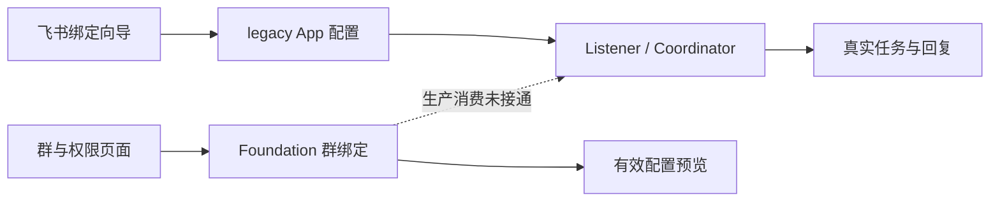

# Dashboard 优化：简洁操作与群内 Bot 配置

分析日期：2026-09-07。源码基线：dutydeck `19c3e66`，botmux `09b9b2b5`。本文保留改动前的分析和方案；实际实现与验证范围见 [交付验收记录](dashboard-management-acceptance.md)。

**优先减少操作层级，把常用设置放到所选 Bot 和群的旁边。** 复用现有群策略模型，补上生产消息的消费链路。用户应能指定：同一个 Bot 在项目群使用项目目录，在值班群使用另一目录；同一个群里的不同 Bot 使用不同 Agent、模型和触发条件。

当前主要缺口有四处：日常操作分散在设置中心和多个弹窗，打开后还要重新选择对象；实际收消息的 Bot 配置与离线群策略分属两套体系；群策略已有的 Agent、目录、模型覆盖没有编辑入口；修改配置后对新旧会话的影响缺少明确说明。只改页面布局，无法解决这些问题。

## 1. 现有能力到哪里了

| 用户要做的事 | dutydeck 当前实现 | 需要补什么 |
|---|---|---|
| 添加多个飞书 Bot，为各 Bot 选不同 Agent | 已支持。绑定向导按 App 保存，listener pool 按 App 管理 | 从 Bot 卡片直接进入所选 Bot，完善列表、搜索和状态 |
| 同群使用多个 Bot，互不串会话 | 已支持基本隔离。会话来源包含 App、chat 和 scope | 保持隔离，补群内 Bot 的集中管理 |
| 同一 Bot 在不同群使用不同目录、Agent、模型 | Foundation 数据模型和管理 API 已支持群级覆盖；当前 live listener 不读取这些配置 | 接入生产解析，并提供完整编辑器 |
| 只在某个群开启群工具、收紧访问范围 | 离线模型支持；当前 live 配置主要在 Bot 层 | 将群级策略贯穿消息、卡片动作、终端和群工具入口 |
| 在 Bot 话题内不必每次 @ | 群策略模型有提及模式；当前 coordinator 的群消息唤醒仍先要求 @ 当前 Bot | 在唤醒前解析有效提及策略，并识别话题归属 |
| 调整普通群回复模式、私聊会话模式 | live server 已有 `groupReplyMode`、`p2pMode` 的存取和路由；Web Bot 表单未暴露 | 复用已有能力，提供行为示例 |
| Bot 入群后，在 Dashboard 找到该群 | live API 已能分页列出 Bot 可见群，Web 未使用；群矩阵只读取 Foundation 中已有 binding/fact | 接通已有列群 API、事实保存和绑定创建，避免发现与配置互相等待 |
| 看清配置是否生效 | legacy 有监听状态；Foundation 一直报告离线管理 | 按 Bot、群、会话分别显示保存、应用和实际使用状态 |

证据分布：Bot 向导及 API 见 E1；生产边界见 E2；群模型和矩阵见 E3；唤醒与会话隔离见 E4；群发现和预检见 E5。

### 两套配置使群设置无法影响实际执行

当前链路如下：



这不是根据界面提示推测的：`service.ts` 把现有飞书入口标为 `legacy_lark`；执行授权器对这条路径返回 `legacy_unmanaged`，不读取群绑定。管理 API 的 `runtimeWired` 固定为 `false`；managed 路径即使权限判断允许，仍会被未激活状态阻断。[E2]

已有模型值得保留：`GroupBinding` 以 `(channelBotId, externalChatId)` 唯一定位，支持覆盖、继承、部分字段清空、revision 冲突检测和权限上限。缺的是使用这些能力的产品流程与运行时接线。[E3]

### 当前群页面还不适合日常管理

- 页面按 Bot 分组展示群卡片，用户要回答“这个群里每个 Bot 怎么工作”，需要跨多个区块查找。
- 编辑器只有回复、提及、群工具和 oncall；Agent、目录、模型、成员授权未提供编辑入口。
- `chat-topic`、`can_talk`、`WP1b` 等实现术语直接进入主流程；用户难以判断选项的实际行为。
- “管理设置”没有传入所选 App，向导初次加载会选择列表第一个 Bot；多个 Bot 时容易打开错误对象。[E1]
- 群设置空态提示“收到群消息后会展示”，但 live 消息尚未写入该矩阵使用的事实仓储。[E5]
- 当前改 Agent、目录、模型或推理强度后，下一次解析会停止不匹配的旧会话并新建；预注入提示词则每轮重新拼接。页面没有说明这两类不同的效果。[E4]

## 2. 从 botmux 借鉴什么

botmux 最有参考价值的是**群详情中的每个 Bot 都是可操作对象**，且操作明确传递目标 App。可以复用这种交互与作用域设计。

| botmux 机制 | 实际实现与限制 | dutydeck 的取舍 |
|---|---|---|
| 群详情按 Bot 展示配置 | 每个 Bot 有自己的 Oncall、Role、卡片 Pin 操作 | 采用“群 → Bot 行 → 本群配置”的主路径 |
| 群内工作目录 | OncallRow → 指定 App 的 API → `oncallChats` → 新会话目录解析；同群各 Bot 可用不同目录 | 直接把“工作目录”作为独立字段，oncall 只表达值班/访问行为 |
| 群角色与 Bot 默认角色 | 群角色优先于 Bot 角色，运行时注入 prompt | 本轮先做目录、Agent、模型、触发和权限；完整角色内容管理另行承接 |
| 群级提及和回复模式 | 有 per-chat store 与入站消费；本次未发现群详情的对应写控件，主要从聊天命令修改 | 补 Dashboard 表单，并与聊天命令使用同一保存/解析逻辑 |
| Bot 默认模型 | Bot Defaults 按 App 配置；本次未发现群级模型覆盖 | 群级模型覆盖使用 dutydeck 已有模型，不宣称来自 botmux |
| 群覆盖矩阵 | 聚合在线 daemon 的群结果，缺席项补 `inChat:false` | 保留离线 Bot；“未返回结果”显示未知，不能直接判定已退群 |
| 配置写入后生效 | 多数 store 写 `bots.json` 并同步内存；部分功能会处理存量对象 | 明确每类设置的生效边界，不笼统写“立即生效” |

这些结论来自 UI → API → store → runtime 的代码追踪，见 E6、E7。botmux 的每 Bot daemon 代理、多个 JSON store、设置页分散等实现结构不适合照搬到 dutydeck。

仓库的《Botmux Dashboard 结构解剖》和《集成方案交叉设计评审》已提出设置入口收敛、群×Bot、远端事实与有效配置分离。本文完整阅读了这两份报告，但以上现状以本次源码和测试为准，不沿用报告中的历史实例数量或完成状态。[E8]

## 3. 用户从哪里进入、能完成什么

### 首页直接做事，管理直接选对象

目标是让用户凭页面上的标签和控件完成操作。采用任务、机器人、群聊三个主要入口；系统设置、迁移草稿和离线自动化留在次级位置。无需新增上手页、教程浮层或步骤清单。

当前首页已有任务空态、Bot 状态和打开飞书的链接；模型与推理设置也已折叠。这些可保留。需要调整的是操作层级：强主按钮始终为“绑定/管理 Bot”，设置中心在监听正常后仍把“管理飞书 Bot”作为下一步；用户日常使用容易反复回到配置。[E9]

| 用户当前要做的事 | 简化后的直接入口 | 页面上的反馈 |
|---|---|---|
| 开始任务 | 首页“新任务”，填写目标、选择项目；Agent 使用已选默认值并可直接切换 | 进入任务详情，立即看到执行状态 |
| 继续已有任务 | 点击任务行，在原页面输入下一条消息 | 保留任务上下文、列表筛选和滚动位置 |
| 在飞书使用 Bot | Bot 行的“在飞书打开” | 直接打开所选 Bot，复用现有 AppLink |
| 调整 Bot 默认值 | 点选 Bot，直接看到 Agent、模型、目录 | 当前值及生效范围，不重新走绑定向导 |
| 调整某群中的 Bot | 选群，在对应 Bot 行点“配置” | 编辑区域固定显示群名与 Bot 名 |
| 处理失败 | 状态旁的具体动作，如“修改目录”“检查连接”“打开终端” | 定位对应对象和问题，不跳到通用设置首页 |

首页有任务时以任务列表和“新任务”为主，Bot 状态收成紧凑摘要；没有任务时保留简短空态和创建按钮。连接异常时给出相关修复动作，不让整个页面被技术警告占满。

### 常用设置直接改，复杂设置按需展开

Bot 页采用列表与详情组合：左边选择 Bot，右边编辑它的默认设置、查看参与的群。群页采用群列表与详情组合：选群后直接看到各 Bot 的配置摘要。两页操作的是同一份群绑定，互相跳转保留所选对象。

群详情的主要区域可以简化成：

```text
项目群                                      搜索 Bot

开发助手   Codex · 项目模型 · /projects/app   [配置]
评审助手   Claude Code · 默认 · /projects/app [配置]

正在编辑：项目群 / 开发助手
Agent [Codex ▾]    模型 [继承默认 ▾]
目录  [/projects/app                 选择]
触发  [新话题需 @，原话题直接续聊 ▾]
权限与群工具 ▸

有未保存修改                          [取消] [保存]
```

这是目标交互示意，使用虚构样本。常用字段无需打开第二个设置弹窗；复杂授权、卡片参数和提示词在同一详情内展开。桌面可用详情区或侧边面板，窄屏切成独立详情页，避免嵌套弹窗和横向大矩阵。

每个字段只呈现当前选择、有效值和来源。选择“继承 Bot 默认”时直接显示继承结果；清空模型与恢复继承用不同操作。顶部只保留一条必要状态，技术错误码、revision、SecretRef 和内部阶段名收进诊断详情。

编辑统一采用“修改 → 保存”：一次提交用户改过的字段，保存后显示成功或具体失败。离开有未保存修改的对象时保留草稿并允许保存或放弃。切换 Bot、群或关闭详情不能悄悄丢字段；遇到版本冲突保留用户修改并展示差异，不要求重新填写。现有群绑定有 revision，legacy Bot 保存没有；第 0 项需补 Bot 的版本检查及原子写入，才能兑现同一套冲突反馈。

一个保存按钮只提交当前对象的编辑：Bot 默认与某群中的 Bot 分开保存。群内 Bot 的行为覆盖和成员授权可能涉及多个实体，需要新增聚合保存 API，复用现有 `groupPolicy.transact`，按各实体 revision 校验后在同一事务提交；任一冲突或校验失败均不写入，返回对应字段/成员的问题并保留全部草稿。现有角色 API 已支持创建和 PATCH，但单独调用多次不能保证整体成功。界面无需按数据库表拆成多个保存按钮；凭据变更、监听控制仍是独立的明确动作。

创建网页任务默认只突出“目标”和“项目目录”，Agent/模型以可点击的当前值展示。沿用现有模型与推理折叠区、发送失败重试复用会话的逻辑。权限保留清晰摘要；选择完全信任仍需现有确认，不能靠隐藏风险信息减少操作。[E9]

目录控件在三个位置共用：网页任务、Bot 默认、群覆盖。当前原生选择器只支持 macOS，Linux 退为手填远程路径。[E10] 建议补受管理认证和目录范围约束的服务器目录选择器，显示实际执行主机、近期有效目录并支持手填。选择结果必须校验存在及访问权限；读取目录不自动授予 Agent 额外权限。

体验验收目标是：常用修改进入所选对象后即可完成，不再经过“设置中心 → 分区 → 另一个弹窗 → 再选 Bot”；同一动作在各入口使用一致标签和保存方式。目标尚未通过新界面实测，不写成已经减少了多少次点击。

### 机器人页：统一默认配置和接入状态

列表展示 Bot 名称、对应 Agent/模型、默认目录、监听状态、已发现群及待处理项。数据读取失败显示“状态未知”，保留最后成功读取时间。

Bot 详情提供三个区块：

| 区块 | 用户可操作的内容 |
|---|---|
| 默认行为 | Agent、模型、推理强度、工作目录；私聊模式、群回复和提及默认值；现有预注入提示词与卡片设置 |
| 群聊 | 此 Bot 参与的群、各群覆盖摘要，点击进入该群中的本 Bot 配置 |
| 接入与权限 | 凭据配置状态、身份检查、监听控制、允许的请求者/Bot、高风险与群工具能力上限 |

修改默认值时，先显示实际受影响的群、具有覆盖的群、继续使用旧设置的会话。统计由服务端根据当前 revision 计算。用户看到的是“这些群的新会话将改用该目录”，而非只看到一个保存成功提示。

凭据仍只写不回显；日常群配置不要求重新填 App Secret。运行时需要的私有信息由服务端解析，不随管理列表返回。

### 群聊页：以群内 Bot 配置为主要操作

默认展示可搜索的群列表，可按 Bot、配置覆盖、状态未知、需要处理筛选。点开群后，展示其中每个已知 Bot：

| Bot | 当前关系 | Agent / 模型 | 工作目录 | 触发方式 | 配置来源 | 操作 |
|---|---|---|---|---|---|---|
| 开发助手 | 已确认在群 | Codex / 项目模型 | 项目目录 | 新话题需 @ | 本群覆盖 | 配置 |
| 评审助手 | 已确认在群 | Claude Code / 默认 | 同一项目目录 | 每次需 @ | 部分继承 | 配置 |
| 值班助手 | 状态未知 | 继承默认 | 继承默认 | 每次需 @ | 继承默认 | 检查状态 |

上表是目标界面的示例数据，不是本机 Bot 清单。群矩阵作为可选总览，点击任一格仍打开同一个群内 Bot 编辑器。

编辑器顶部固定显示“群名 · Bot 名”，包含：

1. **执行设置**：Agent、目录、模型、推理强度。逐字段选择“继承 Bot 默认”或“本群单独设置”，旁边显示继承后的实际值。
2. **消息行为**：如何开始任务、回复放在哪里、话题如何继续。每个选项附一条具体示例，如“新话题需 @ 该 Bot；已归属于该 Bot 的话题可直接续聊”。
3. **谁能使用和操作**：请求者、本人任务操作、群任务操作与管理权限分开；oncall 不额外授予终端或高风险权限。
4. **群工具**：读取、发现、发送分别配置；群级允许不能突破 Bot 的能力上限。
5. **生效说明**：保存后的有效配置、来源、影响的会话；遇到冲突展示差异并保留草稿。

权限不要套用普通字段的覆盖优先级。延续现有 evaluator 的显式拒绝、作用域及独立能力门禁；不要把“后写的配置优先”用于授权。

### 配置状态必须回答“为什么不回复”

把以下事实分别展示，避免用一个绿点代表全部正常：

| 维度 | 应展示的事实 |
|---|---|
| Bot 连接 | 是否配置、是否允许监听、当前进程是否在监听、最近错误 |
| 群关系 | 已确认在群、已确认不在群、无权限读取、未知/过期；检查时间 |
| 本地策略 | 继承默认、存在覆盖、草稿、已应用、冲突或应用失败 |
| 会话使用 | 此会话实际 Agent/目录/模型及配置版本，是否沿用旧设置 |

“已入群”不等于“可发起任务”；“保存完成”不等于“运行时已采用”。错误旁边提供相应动作，例如刷新群状态、选择可用目录、修复 Agent 或查看拒绝原因。错误码和内部阶段名放在诊断详情中。

## 4. 后端如何补齐，避免再增加一套配置

### 保留已有实体，让管理和执行共享同一解析结果

| 现有实体 | 目标职责 |
|---|---|
| `ChannelBotFoundation` | 飞书应用身份、凭据引用、生命周期；需要补齐生产激活契约 |
| `ChannelBotGroupPolicy` | Bot 的默认执行、消息、访问和群工具策略 |
| `GroupBinding` | 某个 Bot 在某个群的覆盖，以 Bot＋chat 唯一定位 |
| `RemoteIdentityFact` / `RemoteChatFact` | 外部身份与群关系证据，带有效期，独立于本地配置 |
| `RoleAssignment` | 带 Bot/群作用域的权限分配 |

“群”页面可以是这些数据的聚合视图，无需再造第三份配置存储。跨 App 聚合群时保留平台和经验证的租户边界；身份不足时保留分别展示，不能只凭同名群合并。

扩展 `resolveGroupEffectiveConfig` 的运行时适配：管理预览、入站路由、会话创建共享一套解析代码。当前 resolver 主要解析 Bot 与群两层；补齐 Agent 默认值、验证和来源后，才能称为执行时的有效配置。

执行字段遵循：新会话显式选择 → 群覆盖 → Bot 默认 → Agent 默认。`inherit` 与 `clear` 保持区别：清空模型覆盖表示交给 Agent 自己选择，不能再回退到 Bot 的同一模型。目录/Agent 无效时报告配置问题，不自动换成另一个目录或 Agent。

解析结果必须保留 `group_clear` 等来源及版本，直到会话选择完成。当前持久化会话匹配把缺省 model 当作任意模型都可匹配，不能直接用于“明确清空模型后新开会话”；否则可能捞回指定旧模型的会话。当前内存配置 key 能区分具体模型值变化，但不携带群策略来源，需要与新版本规则一起适配。更换 Agent 时还要校验继承来的模型/推理参数是否属于该 Agent，避免继承到不兼容的模型。

飞书发言者身份解析是第 1 项的独立交付：持久保存带 App 作用域的 `open_id → principalId` 映射，在消息、卡片和群成员编辑中共用。principal 稳定标识身份；撤销角色或退出群时撤销相应授权、更新成员事实，不靠删除身份映射撤权。身份/凭据校验失效时重新验证相关事实，不能跨 App 复用 `ou_`，也不能把安装管理员当作群消息发送者。

### 先解析群策略，再判断消息是否唤醒

当前 coordinator 先要求群消息 @ Bot，随后才解析 scope。新顺序应为：

```text
接收 App + chat + topic + sender
→ 记录群被观察到的事实，不自动授予访问权
→ 查该 App 的配置来源和该群 binding，解析当前有效策略
→ 判断是否应唤醒、发送者能否发起任务
→ 解析话题/群会话范围
→ 找到现有会话或创建新会话
→ 执行并按该会话约定回复
```

同群的两个 Bot 分别解析自己的策略；“topic 内免 @”只对已归属该 Bot 的话题成立。Bot 对 Bot 的唤醒要保留现有授权边界，并覆盖互相触发的回归场景。

现有 `appId + chat + scope` 隔离应保留。群绑定 ID 表达配置归属，不能替代话题维度的会话 key，否则同群多个话题会串上下文。

### 将发现、配置、激活接起来

优先复用现有 `GET /api/lark/bots/:appId/chats` 分页列群 API，接入“同步此 Bot 的群聊”。第 0 项先展示 live 列表；第 1 项建立 App 映射、凭据引用和身份校验后，将结果保存到对应 Bot 的事实仓储，并允许从列表创建绑定。持久化必须关联本次校验的凭据引用、revision、指纹，以及身份 fact ID、revision 和有效期，复用身份预检的写入逻辑。直接把 legacy API 返回的群 ID 写成 `member` 不足以形成有效事实：现有 `remoteChatFactValidity` 会把缺少这些关联的记录判为未知。成员列表 API 也已存在，可作为群权限编辑的候选数据来源；候选成员仍需正确解析为带 App 作用域的 principal。

补充使用已收到的群事件、现有会话/消息映射，以及手动输入群 ID 后验证。旧会话记录只能说明“曾经观察到”，不能证明现在仍在群。

身份预检已经能检查已知 binding，复用它更新事实；还需将结果接入页面，并显示过期、凭据变化、部分失败等状态。shared 已有 `remoteChatFactValidity` 和 `toPublicRemoteChatFact`，但 group-matrix 的本地 `publicFact` 丢掉了有效性和过期信息，blocker 也只看 `membershipState`。应复用 shared 的有效性投影，同时保留列表需要的群 ID/名称，让状态和修复动作使用同一判定。[E3、E5]

真实权限和列群 API 的返回覆盖需要用测试 App 验证，不能承诺能列出租户全部群。分页拉取失败时保留已有事实并标记同步未完成，不把缺页里的群判定为退群。新发现群默认继承该 Bot 已明确选择的访问策略，不因发现动作扩大权限。

### 兼容现有 Bot，按 App 明确切换配置来源

建议在既有 listener manager 中接入新策略，按 App 决定当前唯一配置来源。无需为群配置再启动一套 listener，也无需等待整套 botmux importer、Schedule 或历史迁移完成。

1. 为现有 live Bot 建立稳定的 App → ChannelBot 映射，把当前设置转换为可比较的草稿。已有同 App 的迁移草稿有冲突时先显示差异，禁止盲目合并。
2. 对齐现有行为。除了目录和模型，还需承接预注入提示词、peer Bot、成员权限、高风险控制和卡片参数；目前 Foundation 不是完整的 `StoredLarkConfig` 替代品。明确私有字段的服务端归属及凭据引用后再切换。
3. 离线检查身份、Agent、目录、权限与旧行为差异；修复 app-scoped sender 到 principal 的映射。Web 安装管理员身份不能代替飞书发言者身份。
4. 使用现有 listener 的单一入口，按 App 应用配置来源切换。保留消息队列、去重及会话映射；listener ownership 和并发切换保护需通过功能验证。
5. 切换后所有管理写入和新请求读取统一来源；不再双写 legacy 与 Foundation。新路径出错时展示应用失败，不隐式降回旧配置继续执行。

生产 activation 目前没有实现；必须扩展状态、授权器、实际配置加载和运行时回执，不能只把 `runtimeWired` 改为 `true`。既有导入草稿的 `staged` / `disabled` 状态继续保持禁用，建立映射本身不激活 Bot。

当前硬限制分别位于 `packages/shared/src/index.ts:106` 的 Bot 状态及监听/full-trust 字面量，`packages/shared/src/group-policy.ts:502` 的运行时拒绝，以及 `apps/server/src/foundation-policy.ts:173`、`:213` 的入口拒绝。需要把这些限制统一改成基于经验证的激活状态和当前授权的判定，并覆盖未激活、撤销和身份失效路径；不能只移除拒绝语句。

### 分清新会话设置和当前权限

| 变更 | 建议生效方式 |
|---|---|
| Agent、目录、模型、推理强度 | 默认用于新会话；已有话题继续原上下文。页面说明差异，提供明确的新开会话动作 |
| 预注入提示词 | 保留现有每轮注入语义，从下一轮使用新文本；当前轮不变，页面显示该生效说明 |
| 群/话题会话模式 | 新范围按新规则建立；已有话题映射保留，避免悄悄创建空上下文 |
| 提及条件、发起任务权限 | 下一条入站消息按当前策略判断 |
| 终端、高风险、群工具授权的撤销 | 下一次受控动作重新校验；旧会话快照不得保留已撤销权限 |
| 监听开关、凭据变更 | Bot 级操作，显示受影响群与运行状态；应用完成后才更新状态 |

因此需要同时记录“会话创建时的执行配置”和“动作发生时的授权决定”，在现有会话记录基础上补齐持久化和生产路径写入。当前只有 Schedule 意图中的嵌套 `runSnapshot` 字段，未实现可直接复用的生产 RunSnapshot 实体/仓储，不能把这部分按现成功能估算；仅增加字段或表不算验收。

这里的“旧话题保留原执行设置”是建议变更，并非当前行为。当前 `resolveLarkSession` 会因 Bot 默认值变化停止旧会话；实现时需要把会话配置版本与群当前默认分开，保留原话题映射，并对这一兼容性变化增加测试。不能只修改保存按钮旁的说明文字。

并发编辑沿用 `expectedRevision`。冲突时对比原值、用户草稿、最新值；不能仅换成最新 revision 后提交整份旧草稿，覆盖另一人的修改。未改字段不进入 patch。

## 5. 实施顺序与验收

| 顺序 | 交付结果 | 验收条件 |
|---|---|---|
| 0. 简化常用操作 | 正确对象跳转、常用字段直接编辑、统一保存与目录选择、legacy Bot 版本校验、接入已有分页列群 API、暴露已有私聊/群回复模式 | 从所选 Bot/群直接完成现有设置修改，切换不丢草稿；两个编辑者及不同 App 同时保存不丢更新；这一步仍不代表群级覆盖已生效 |
| 1. 打通一条真实配置链路 | App 映射、有效配置解析、群发现、身份/权限与激活；复用现有 listener | 通过管理 API 设置一个群内 Bot 的目录/Agent，合成飞书入站真正启动指定 CLI；另一个群和另一个 Bot 不受影响 |
| 2. 完成日常管理页面 | Bot 默认页、群列表、群详情、完整群内 Bot 编辑器、对象深链 | 浏览器保存后刷新可读回；从指定 Bot/群进入始终选中正确对象；可完成默认继承和覆盖恢复 |
| 3. 讲清并验证生效行为 | 有效值来源、变更影响、会话差异、冲突处理、失败修复入口 | 新旧会话行为与界面说明一致；应用失败不报成功；并发编辑不丢更新 |
| 4. 提升多群管理效率 | 筛选、可选矩阵、只复制行为字段、批量更改继承/覆盖 | 批量动作展示逐项结果和冲突；复制不带凭据、成员授权、App 身份或监听状态 |

第 0 项可独立推进；第 1–3 项组成群级管理的完整首轮交付，不能以离线表单可保存代替完成。第 4 项在主链稳定后做；VC、工作流、完整角色编辑、Schedule 执行不纳入本轮。

legacy Bot 目前以整个 `lark.bots` 数组读改写。第 0 项的版本检查必须与保存处于同一原子操作，既检查目标 App，也保护同一数组里其他 App 的更新；配置来源切换后沿用统一版本语义，不保留两套相互覆盖的保存入口。

核心验收采用 **2 个 Bot × 2 个群** 的隔离测试样本：

- 操作路径：选中 Bot/群后直接编辑常用项；从任务详情跳转配置再返回不丢任务和筛选状态，刷新仍定位原对象。
- 表单行为：继承后的值直接可见；保存只更新修改字段；群行为和成员授权一起修改时，任一冲突均整体不写入；切换对象、失败与冲突均不丢草稿；Linux 可选择服务器目录。
- 可用性：无需额外指引完成创建任务、改 Bot 默认、改群覆盖、恢复继承四项操作。功能通过后由未参与开发的人实际操作，记录误点、回退、求助与耗时，作为进一步简化的依据。
- 同 Bot 不同群：各自使用指定目录/Agent/模型；验证真实 CLI 参数、工作目录和会话记录。
- 同群不同 Bot：只唤醒满足条件的 Bot；会话、工具授权和回复目标不串。
- 群覆盖与继承：改 Bot 默认只影响继承字段；恢复继承、清空模型、非法目录都有明确结果。
- 话题继续：修改默认值后旧话题仍有原上下文；新会话使用新设置；免 @ 不唤醒其他 Bot 的话题。
- 权限一致：消息、聊天命令、卡片动作、终端、群工具使用相同作用域；跨 App 的用户身份不可直接复用。
- 群事实：离线、权限不足、退出群、凭据轮换导致的事实过期不被显示为正常；发现群不授予权限。
- 重启与并发：配置持久化、listener 唯一、会话映射恢复；两处同时编辑返回冲突并保留用户草稿。
- 浏览器全链路：页面编辑 → 真实 API → SQLite → 入站事件 → 测试 CLI → 回复，覆盖桌面与窄屏；避免只断言 mock API 收到字段。
- 涉及 ACPX 配置/环境注入时，用真实 `AcpxAdapter` 与持久化 session key 测试；群工具变量保持 `dutydeck_group_tools_url`、`dutydeck_group_tools_token`。

## 6. 本次验证与证据

本次只读勘察两个仓库，新增本文。没有改产品代码、真实配置或服务状态，没有调用真实飞书发送或 Bot 管理动作。

| 验证 | 本次结果 | 能证明什么 |
|---|---|---|
| dutydeck 的 GroupPolicyModal、LarkConfigModal、ControlCenterModal DOM 测试 | 3 文件，38 项通过 | 当前表单、草稿状态及 API 调用契约；API 被 mock，不证明生产策略生效 |
| dutydeck 的 WorkspaceOverview、NewSessionModal DOM 测试 | 2 文件，38 项通过 | 当前首屏、空态、新任务表单与重试行为；不代表新设计已通过可用性验证 |
| dutydeck 配置、会话解析、listener、coordinator recovery、Foundation 路由/权限、群策略存储、app、agent-tools、chat-mode 测试 | 10 文件，239 项通过 | 当前配置与策略边界、路由和隔离逻辑；使用内存/临时 SQLite 与 fake Lark |
| botmux Oncall、提及模式、Role、Pin、群矩阵及多 Bot 群流测试 | 6 文件，77 项通过 | 相应配置存储、解析及隔离测试链路；外部飞书为测试替身 |
| 独立代码勘察 | 两路勘察完成，证据已纳入本文 | 交叉核对两个仓库的 UI、API、存储和运行时；不等同于完整方案复核 |
| herdr 调度 `ccflash` 与 `claude --dangerously-skip-permissions` 方案复核 | 两路均完成；修订后增量复核均为 DONE，无残留阻塞 | 已修正保存事务、群事实有效性、身份映射、激活边界及会话记录等问题；复核未重跑测试 |

前端测试实际命令：`node node_modules/vitest/vitest.mjs run apps/web/src/components/GroupPolicyModal.dom.test.tsx apps/web/src/components/LarkConfigModal.dom.test.tsx apps/web/src/components/ControlCenterModal.dom.test.tsx`。`pnpm exec` 在当前环境触发依赖检查并尝试安装，因无 TTY 中止；改用已有 Vitest 直接运行，未安装或清理依赖。

其余验证由两个只读勘察单元回报。dutydeck 使用同一 Vitest 入口执行上述 10 个服务端/存储文件；botmux 分别执行 unit 项目的 `role-resolver`、`pin-streaming-card-mode-store`、`dashboard-groups-matrix-snapshot`、`oncall-store`、`mention-mode-command`，以及 e2e 项目的 `multi-bot-group-flow`。加上主控执行的 5 个 Web 测试文件，共计 dutydeck 315 项、botmux 77 项通过；这些是本次选定测试的数量，不是全仓测试总数。

真实飞书权限、线上 Bot/群数量、部署中的前端版本、实际群内交互与性能均为 **unverified**。本文不把本地单测通过作为线上能力已实现的证据，也不给未经测量的工期数字。

证据索引，行号对应本文开头的源码基线：

- **E1 — 现有管理入口**：`apps/web/src/components/LarkConfigModal.tsx:33`、`:59`、`:77`；`apps/web/src/components/ControlCenterModal.tsx:224`；`apps/web/src/api.ts:10`、`:95`；`apps/server/src/lark/config.ts:16`、`:67`、`:323`。
- **E2 — 管理与执行边界**：`apps/server/src/service.ts:141`；`apps/server/src/foundation-policy.ts:149`、`:173`、`:213`；`apps/server/src/foundation-routes.ts:55`；`apps/server/src/lark/listener.ts:112`。
- **E3 — 群模型、解析和 UI**：`packages/shared/src/group-policy.ts:60`、`:117`、`:308`、`:368`、`:376`、`:399`；`packages/storage/src/migrations.ts:193`；`packages/storage/src/group-policy.ts:455`；`packages/storage/src/group-policy.test.ts:58`；`apps/server/src/foundation-routes.ts:101`、`:153`、`:277`；`apps/web/src/components/GroupPolicyModal.tsx:9`、`:211`。
- **E4 — 唤醒和会话**：`apps/server/src/lark/coordinator.ts:254`、`:1384`；`apps/server/src/lark/session-resolver.ts:26`、`:65`、`:140`、`:190`、`:245`；`apps/server/src/lark/listener.ts:191`；`packages/shared/src/schedule-foundation.ts:217`。
- **E5 — 群事实入口**：`apps/server/src/lark/routes.ts:116`、`:123`；`apps/server/src/identity-preflight-routes.ts:51`、`:94`、`:113`、`:179`；`apps/server/src/lark/listener.ts:112`；`apps/web/src/components/ControlCenterModal.tsx:301`。
- **E6 — botmux 群管理主链**（以下路径相对 `../botmux`）：`src/dashboard/web/groups-page.tsx:1000`、`:1368`；`src/dashboard.ts:2915`、`:6288`；`src/core/dashboard-ipc-server.ts:4172`；`src/services/oncall-store.ts:24`；`src/core/command-handler.ts:760`、`:813`；`src/services/chat-reply-mode-store.ts:1`；`src/im/lark/event-dispatcher.ts:2750`、`:2929`、`:4056`。
- **E7 — botmux 默认值、Role 与 Pin**：`src/dashboard/web/bot-defaults-page.tsx:769`；`src/dashboard.ts:6323`；`src/dashboard/web/groups.ts:175`；`src/core/role-resolver.ts:208`、`:276`；`src/core/session-manager.ts:916`；`src/services/pin-streaming-card-mode-store.ts:16`；`src/core/worker-pool.ts:2466`；`src/daemon.ts:22343`。
- **E8 — 已完整阅读的历史报告**：[Dashboard 结构解剖](botmux-dashboard-anatomy.md)、[集成方案交叉设计评审](botmux-integration-design-review.md)。前者主要用于信息架构取舍，后者用于核对已提出的群策略边界。
- **E9 — 首屏和日常交互**：`apps/web/src/components/WorkspaceOverview.tsx:149`、`:218`、`:275`；`apps/web/src/components/ControlCenterModal.tsx:124`；`apps/web/src/components/NewSessionModal.tsx:66`、`:146`。
- **E10 — 远程目录选择缺口**：`apps/server/src/system-routes.ts:34`；`apps/web/src/components/NewSessionModal.tsx:129`。
