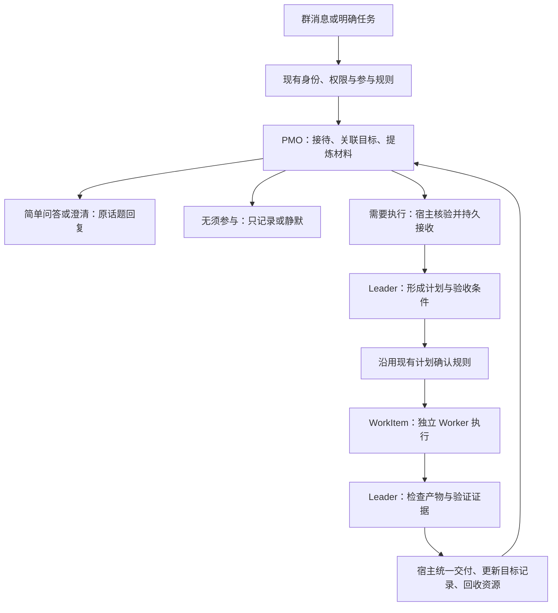

# Tag 可选分层协作方案

2026-09-23。状态：代码核查与设计完成，功能未实现。核查结束时基线为 `2719a99`；本轮只新增此方案文档。

**可以采用 PMO + Leader + Worker，但应按任务需要启动各层。** PMO 接待、关联会话和记录上下文；Leader 负责复杂任务的拆分与验收；Worker 在独立会话完成具体工作。简单问答留在 PMO，不为每条消息固定增加三层调用。Dashboard 提供可选模式，现有 Bot 不自动切换。

预期收益是减少执行会话中的无关群聊、让接待不被长任务占住、明确谁负责验收。三层本身不保证更快或更省：复杂任务会增加规划、交接与验收开销。延迟、费用和效果改善均为 **unverified**，需要同一批任务对比后判断。

## 现有底座可以复用，缺口在交接与完成判定

| 当前实现 | 对方案的意义 |
|---|---|
| 普通消息先观察；明确唤醒继续进入正常任务路径。参与判定和回复各用一个独立 `deny-all` 会话，结束后停止 | 已有 PMO 的只读接待基础，不需要重新建立群监听。见 [coordinator.ts](../apps/server/src/lark/coordinator.ts)、[readonly-decider.ts](../apps/server/src/lark/readonly-decider.ts) |
| 判定和回复均使用 `memoryAgentId ?? defaultAgentId`，模型也沿用记忆或默认配置 | 接待模型与记忆整理设置耦合，应拆出独立角色配置；只改提示词无法解决。见 `readonly-decider.ts` 的 `runPrompt` |
| `act` 只形成行动候选，随后标记 `suppressed` | 目前没有自动交给 Leader 的路径。新模式必须补授权、幂等和恢复，不能把该分支直接改成启动 Agent。见 [group-participation.ts](../apps/server/src/lark/group-participation.ts) 的 `decide` |
| WorkItem 已有父会话、操作者、固定执行请求、依赖图、独立子会话、worktree 和结果交付 | Leader→Worker 复用该编排服务。当前计划最多 12 步，单目标最多同时运行 3 步，全局最多 6 步；这些是代码上限，不是容量实测。见 [work-items.ts](../apps/server/src/work-items.ts)、[计划定义](../packages/shared/src/work-items.ts) |
| Worker 获得目标、步骤指令和直接上游生成结果；不能嵌套创建 WorkItem | 已有上下文隔离。Leader 应在父会话提交有限计划，不建立递归委派树。最终验收可由新的 Leader 会话执行 |
| 步骤完成核实的是固定 Attempt 的成功结果和非空输出 | Worker 声称“测试通过”还不是业务验收；需补结构化验收结果，才能让失败验收阻止目标显示完成 |
| 判定会话立即停止；WorkItem 正常成功路径不立即停止子会话，运行时另有通用空闲回收，默认空闲阈值为 6 小时 | “完成自动回收”要单独实现并核实停止结果。见 [运行时](../packages/agent-runtime/src/index.ts) 的 `cleanupIdleDriversOnce`；部署是否覆盖该阈值 **unverified** |

使用说明已完整阅读：[通用群协作能力](generic-collaboration-implementation.md)。以上能力与限制以本次代码及回归检查为准，不沿用历史验收数字。

## 分层后的用户体验



| 角色 | 接收什么 | 负责什么 | 交付什么 |
|---|---|---|---|
| PMO | 当前消息、必要观察、已有目标索引和精炼状态 | 判断对象与意图、关联已有目标、回答可直接回答的问题、提出交接或状态更新 | 有来源的简短回复，或目标、约束、材料引用与目标编号 |
| Leader | 原请求与交接摘要、必要来源、选定 Worker 能力 | 定义完成条件、拆分独立执行单元、处理阻塞、验收成果 | 有依赖关系的计划；通过、需返修或缺少信息的验收结果 |
| Worker | 分派任务、允许访问的材料、工作目录、必要上游产物 | 实现、调查或测试指定单元 | 产物位置、变更、验证命令与结果、未完成项 |
| 宿主 | 原始身份、当前权限、配置版本和各层结构化输出 | 授权、幂等、调度、状态持久化、交付与停止 | 可核对的任务状态、执行记录和交付回执 |

Leader 的角色规范应随配置固定：分派目标、边界、依赖接口和完成条件，让 Worker 自行选择实现步骤；只在阻塞、验收或范围变化时介入，不逐条指挥 Shell 命令。可通过项目内可发现的 Skill 和现有步骤指令快照交付这些规范；资源归属、权限和停止仍由宿主执行。

例：“这周可以试试分离缓存”先由 PMO 收集约束，不立即创建开发任务；“@机器人，按刚才讨论改造缓存并跑测试”才交给 Leader。执行中“做到哪里了”从已记录状态回复；“同时兼容旧配置”关联原目标，交给 Leader 更新计划，不将整段新群聊复制给所有 Worker。

会话定位先用明确的回复关系、任务编号和话题映射，再让 PMO 在当前操作者可访问的候选目标中选择。多个目标都合理时澄清；不能仅凭相似文本跨群附加到别人的任务。长任务执行期间，PMO 仍可处理无关问答。

本方案覆盖群消息产生的新任务；私聊及已有定时委托沿用当前入口。停止命令、权限审批、计划确认和待回答问题的续答优先走现有处理器，不交给 PMO 重新分类。

## Dashboard 增加执行方式，保持参与方式独立

现有“关闭 / 仅观察 / Tag 按需参与”回答何时参与；新增“执行方式”回答接下任务后如何分工，两者分开配置。

| 选项 | 对用户的具体影响 |
|---|---|
| **现有方式，默认** | 保持当前判定、回复和执行行为，不迁移已有配置或任务 |
| **分层协作：PMO + Leader + Worker** | PMO 负责接待；复杂任务有独立规划、执行与验收，dashboard 展示分工和总进度 |

在 Bot 管理页设置默认执行方式，群管理页可选择跟随 Bot 或覆盖方式。角色配置先集中在 Bot 级：PMO Agent/模型、Leader Agent、允许使用的 Worker 列表。群页展示最终生效值及来源，不复制一套模型编辑表。现有记忆整理配置继续只服务记忆整理。

角色从本实例已配置 Agent 中选择。PMO 必须支持运行时的只读限制，Leader 必须能使用编排入口；配置存在不代表实际可运行。Worker 目前按 `agentId` 固定 Agent 配置，步骤没有单独 `model` 字段：Leader 和 Worker 的模型在对应 Agent 定义中设置，分层配置展示其生效值。规划父会话与最终验收步骤使用同一 Leader 定义，避免模型覆盖只在其中一处生效。

用户举出的 Flash、Fable 5.1、Codex、Gemini 3.8 Flash 作为角色选型线索，不硬编码成产品默认值。其在当前实例的可用性与性能 **unverified**。应按可用性、结构化输出可靠性、工具支持和实测表现选择；同一模型也可以担任多个角色，隔离会话仍有价值。

保存沿用版本冲突检查，失败保留草稿。切换执行方式只影响新任务；运行中任务保留原角色与配置快照，权限撤回立即生效。切回现有方式不会静默取消已接受的工作。

## 用现有 WorkItem 承接任务，补齐四处连接

**一、PMO 配置与交接。** 复用当前两阶段只读判定和回复，拆出专用 Agent/模型配置。新模式中的 PMO 可提出 `handoff` 或向已有目标追加材料；它自己没有 Shell、编排写入凭证或对外发送权限。宿主验证后落账和执行，历史、引用及其他机器人发言不能成为新的执行授权。

显式 @ 目前跳过只读参与判定，不能仅修改 `act` 分支。新模式在 coordinator 完成入口授权、inbox 领取、消息解析及命令/续答处理后，将普通显式任务送入专用 PMO 入口，并结束原来的默认 Agent 派发分支。未显式唤醒的消息仍走参与判定，获准交接时进入同一个宿主接收函数。两条入口以同一原消息身份互斥；恢复时沿用已落账的路由结果，不再次判定并双派发。

交接至少冻结：Bot/群/话题、原消息与操作者、目标和约束、证据引用、目标会话编号、角色配置版本、稳定请求键。原消息与请求键约束同一交接；附加到已有任务时还带预期版本。先持久接收，再启动或追加任务；响应丢失和服务重启按原键核对，不重新拆出替代目标。

原始消息仍是授权与事实来源，PMO 摘要不能替换它。PMO 的群上下文继续受大小上限约束；目标索引仅带目标、状态、阻塞和产物引用，Worker 的日志与完整代码留在执行记录中。执行反馈通过宿主更新索引，不作为一条新的普通群消息再次触发 PMO。

**二、Leader 是父会话，Worker 是子步骤。** Leader 使用现有 `dutydeck work` 创建有限 DAG：独立 Worker 单元 → 必要整合 → Leader 验收。Leader 父会话保留当前飞书来源和操作者，避免放进 `source: work_item` 子步骤后又要求它创建嵌套工作项。交接持久接收后结束接待轮次，后续依靠事件回传，不轮询占住 PMO。

新增宿主管理的 Leader 会话映射，按 Bot、群、原话题、操作者和目标编号绑定独立父会话；不复用原话题已经存在的默认 Agent 会话。`source` 保持 `lark`；有话题时 `sourceId` 使用 `appId:chatId:group:thread:<root-or-thread-id>:role:leader:<stable-id>`，无话题时才使用 `appId:chatId:group:role:leader:<stable-id>`。现有 `larkAgentSessionBinding` 依赖第四段 `thread` 恢复话题范围，不能用角色字段取代它而扩大到全群读取。会话解析和持久映射按完整 `sourceId` 查找；第三段继续支持群权限及计划确认。启动意图与会话编号持久绑定，启动结果不明时核对原资源，不另开会话；续问通过目标索引找到同一 Leader。

交付来源也要显式接线：原消息的 Bot、群、消息编号、回复位置随交接落账。Leader 工具创建 WorkItem 时，宿主依据该任务的交接记录，以工具实际使用的稳定请求键调用 `workbench.recordOrigin`，再调用 `create/prepareDelivery`。不能依赖 PMO 回复自动生成 `lark-card` 映射。计划确认卡、进展和最终交付共用这条来源；重启读回同一目标，缺失来源则阻止派发，不猜测最近一条卡片。

群内 Agent 提出的 WorkItem 计划目前需要人工确认后派发；本方案沿用该行为。管理员选择分层只改变分工，不自动扩大群成员权限，也不替用户批准计划。未来如需改变确认策略，应作为单独的产品行为处理。

**三、验收和返修明确落账。** 最终验收要引用 Worker 的固定结果、实际产物及验证证据，返回 `passed / changes_requested / needs_context`。新增宿主解析和完成条件：只有 `passed` 才能把业务目标展示为完成；无法解析或证据不足进入待核对，不能因模型成功输出一段文字而绿灯。

`changes_requested` 回到原 Leader 父会话，由它生成带版本的新计划，仅重做受影响步骤；旧结果和旧计划保留。当前 WorkItem 只支持重试失败步骤，尚不支持成功步骤因业务验收未过而失效、重做及重算下游，因此这是需要补齐的接口。应限制一次任务的自动返修轮数和累计执行预算，耗尽后回报阻塞，不能递归派发。

并行写代码继续用独立 worktree，但必须有显式整合步骤，把各分支成果带到验收工作目录，再跑整体验证。上游输出包含一个文件路径，不代表下游 worktree 已包含该修改。只读检查可共享目录；重叠写入由 Leader 合并为一个执行单元。

代码 Worker 交付清单必须绑定仓库、起始 commit、所属 worktree/步骤/Attempt、变更文件，以及结果 commit 或已持久保存的补丁与摘要。宿主检查引用归属和内容后保存；整合步骤从约定基线建立受控目录，按依赖顺序应用这些提交或补丁，记录最终 commit/变更摘要，再在同一目录运行整体验证。基线漂移、冲突或补丁缺失时进入阻塞/返修，不能覆盖别人的修改或只读 Worker 的成功说明。验收绑定整合后的代码指纹与测试证据。该清单及整合执行契约目前需要新增，现有上游文本传递不能替代它。

**四、资源回收与交付分开。** Worker 的结果、验证证据和终端快照持久保存后，由宿主停止本任务拥有的执行会话，再折叠活动面板。停止失败保留“待回收”，独立重试，不将其伪装成已关闭。失败或取消也做同样的资源对账；正在等待授权或缺少输入的任务仍保留可继续入口。

回收运行进程不删除任务历史、产物或未合入的 worktree，也不停止 Leader 父会话或其他任务的终端。群内最终输出仍由宿主统一投递，绑定原话题及原动作编号；PMO 更新记录，不再转发一份相同结果。

本机 `herdr --skill` 已完整读取。其 pane 操作依赖可验证的 caller/资源归属，`idle`、`done` 或屏幕上出现完成文字不等于代码验收通过。可以借鉴“明确分工、读回证据、只回收本任务资源”，不把外部 Herdr 面板作为 Dutydeck 核心调度依赖。用户提到的 `herdr-leader` 规范原文未提供，**unverified**；本方案没有假定已经安装或加载它。

## 实施范围与通过标准

| 改动单元 | 主要位置 | 必须验证的结果 |
|---|---|---|
| 配置及 dashboard | `lark/config.ts`、Bot 配置投影与群解析、`BotManagement.tsx`、`GroupManagement.tsx`、`draft-store.ts`、API 类型 | 旧配置行为不变；角色选择保存/读回一致；群继承与覆盖正确；冲突保留草稿；无效角色不能启用 |
| PMO 与交接 | `readonly-decider.ts`、`group-participation.ts`、`coordinator.ts`、`session-resolver.ts`、`workbench.ts` 和执行接收层 | PMO 无写权限；显式/普通入口只交接一次；Leader 不误复用默认会话且不能读到绑定话题外的消息；续问命中原目标；原话题投递可恢复；无来源授权不执行 |
| Leader 与执行 | `work-item-tools.ts`、`work-items.ts`、共享计划/结果类型、运行时 | Worker 独立上下文；计划确认继续生效；权限撤回停止后续执行；并行产物能整合；失败验收不显示完成；返修只影响相关步骤 |
| 交付与回收 | WorkItem 完成处理、运行时停止接口、任务进度与终端面板 | 结果先保存再释放资源；停止结果不明可核对；一处最终交付；停止后仍可读历史；不误删成果和 worktree |

完整模式应连同这四部分和端到端验收一起交付。只增加“PMO Agent”下拉框可以解开配置耦合，但不能标成三层模式已经完成。

若调整 ACPX session 配置或运行时环境注入，按仓库约束使用小写 `snake_case` 持久化键，并用真实 `AcpxAdapter` 和持久化 session key 回归；只 mock ACP 客户端不算覆盖。

比较现有方式和分层方式时，使用相同任务集：简单问答、连续发散讨论、已有任务续问、多文件实现、验收失败返修、服务重启和取消。记录首次有效回应时延、总耗时、各层输入输出 token、调用次数、误交接/误关联、产物验收结果和资源残留。区分“已接下”的提示与实际完成，避免用快速回执掩盖执行变慢。目前没有实测收益数字。

本轮在当前工作区执行：

```sh
pnpm exec vitest run apps/server/src/lark/readonly-decider.test.ts apps/server/src/lark/group-participation.integration.test.ts apps/server/src/work-items-ledger.integration.test.ts
```

结果：**3 个文件、29 项通过**。包含真实 Runtime/SQLite、真实 `AcpxAdapter` 对本地协议测试程序、真实 JSONL 测试子进程及重启对账；飞书投递和模型输出仍有测试替身。该结果验证可复用底座，不代表三层模式已经实现，也不证明真实供应商模型的速度与质量。
